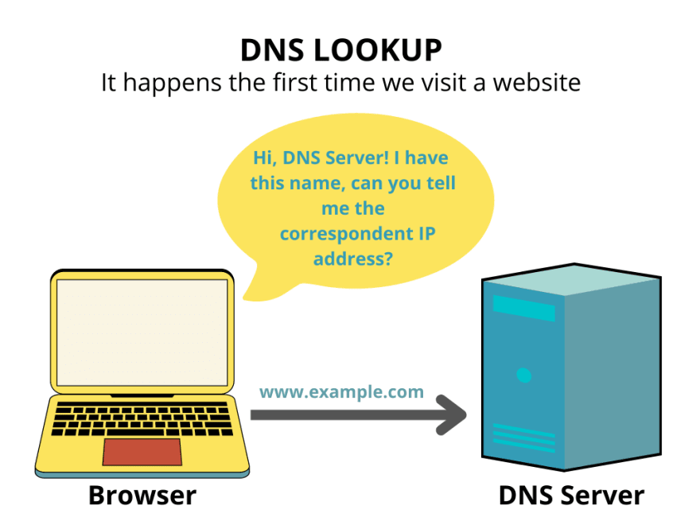
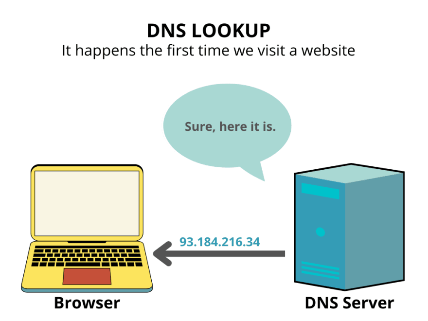

**Understanding DNS Servers in Simple Terms**
A DNS server is like a phonebook for the internet, translating website names (like www.example.com) into computer-friendly numbers (IP addresses) so you can access websites easily.

**What is a DNS Server?**

DNS stands for Domain Name System, and a DNS server is a crucial component of the internet that helps us access websites and other online resources easily. It's like a giant address book for the web, translating human-friendly website names (like www.example.com) into computer-friendly IP addresses (like 203.0.113.1). In simple words, DNS servers act as translators, helping your computer find the right internet location for the websites you want to visit.

**How Does a DNS Server Work?**

When you type a website URL into your browser and hit Enter, your computer needs to know the IP address of that website's server to connect to it. Here's how a DNS server helps in this process:

1. **Requesting Translation**: Your computer sends a request to a DNS server, saying, "Hey, I want to visit www.example.com. What's its IP address?"

2. **Checking the Address Book**: The DNS server checks its vast "address book" called the DNS database, which contains a list of domain names and their corresponding IP addresses.

3. **Finding the IP Address**: If the DNS server finds a match for www.example.com in its address book, it sends back the corresponding IP address to your computer. For example, it might say, " The IP address for www.example.com is 203.0.113.1."

4. **Connecting to the Website**: Armed with the IP address, your computer can now connect to the server hosting www.example.com. It's like having the exact location of the website, allowing your computer to request and receive the web page you wanted to visit.

**Types of DNS Servers**

There are different types of DNS servers, each serving a specific purpose:

1. **Recursive DNS Servers**: These are like helpful assistants. When you request a website's IP address, recursive DNS servers search through the address book or ask other DNS servers for the information, ensuring you get the correct IP address.

2. **Authoritative DNS Servers**: These are like experts for specific domains. They hold the official records for certain domain names, such as example.com. When a recursive DNS server can't find an IP address, it goes directly to the authoritative DNS server for that domain to get the right answer.

**DNS Caching**

To speed up the process and reduce the load on DNS servers, your computer, router, or ISP (Internet Service Provider) often stores recently accessed IP addresses in a temporary memory called DNS cache. This way, if you visit the same website again, your computer can quickly find the IP address in its cache without asking the DNS server again.

**Summary**

So, the next time you enter a URL in your browser, remember that a helpful DNS server is working behind the scenes to get you to your destination.