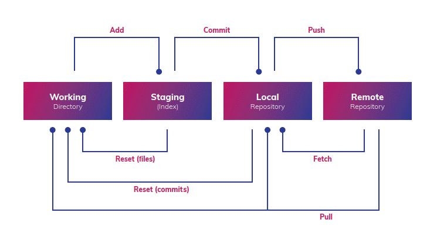

**Introduction to Git:**

Git is a version control system that allows developers to track changes in their code and collaborate efficiently. It is widely used in software development to manage code versions, work on new features, and resolve conflicts when multiple developers are working on the same project. This documentation will guide you through the process of installing and setting up Git on your computer.

 
**Step-by-Step Guide to Install and Setup Git:**

**Step 1: Download Git:**
- Go to the official Git website: https://git-scm.com/.
- Click on the "Download" button to download the Git installer for your operating system (Windows, macOS, or Linux).

**Step 2: Install Git:**
- Windows:
  - Double-click the downloaded .exe file to run the installer.
  - Follow the on-screen instructions. Choose the installation directory, select components (default options are usually fine), and configure the PATH environment (select "Use Git from Git Bash only" or "Use Git and optional Unix tools" options).
  - Click "Next" and "Install" to begin the installation process.
  - Once the installation is complete, click "Finish."

- macOS:
  - Double-click the downloaded .dmg file to open the Git installer.
  - Follow the on-screen instructions. Click "Continue," "Continue," "Install," and enter your computer's password to allow the installation.
  - Click "Close" when the installation is complete.

- Linux:
  - For Debian-based systems (e.g., Ubuntu):
    - Open the terminal and run the command: `sudo apt-get install git`
  - For Red Hat-based systems (e.g., Fedora):
    - Open the terminal and run the command: `sudo dnf install git`

**Step 3: Configure Git:**
- Open a terminal or command prompt (on Windows, use Git Bash or Git CMD).
- Set your username: Run the command: `git config --global user.name "Your Name"`
- Set your email address: Run the command: `git config --global user.email "youremail@example.com"`

**Step 4: Verify Git Installation:**
- To check if Git is installed correctly, run the command: `git --version`
- You should see the installed Git version in the terminal.

**Step 5: Set Up a Git Repository (Optional):**
- Navigate to the folder where you want to initialize a Git repository (a folder that will contain your project).
- Run the command: `git init`
- This creates an empty Git repository in the selected folder.

**Summary:**

Congratulations! You have successfully installed and set up Git on your computer. Now you can use Git to track changes, collaborate with other developers, and manage your code efficiently. Git is an essential tool for version control in software development, and learning how to use it will greatly benefit your development workflow and project management. Happy coding!