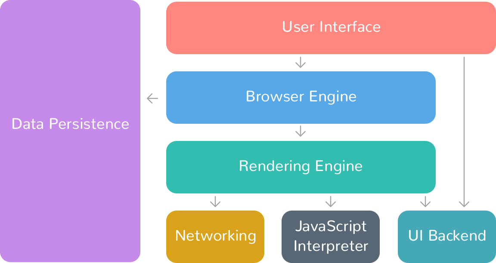

**Different Components of a Browser**

**Introduction:**

A web browser is a software application that allows users to access and interact with websites on the internet. It serves as a gateway between the user and the World Wide Web, rendering web pages and executing web-related tasks. A browser is made up of several components, each playing a specific role in the browsing experience. This documentation will explain the different components of a browser in simple words.

 

**1. User Interface (UI):**

The user interface is what you see on your screen when you open a web browser. It includes various elements such as the address bar, navigation buttons (back, forward, refresh), bookmarks, and settings. The user interface allows you to interact with the browser and navigate through websites easily.

**2. Address Bar:**

The address bar, also known as the URL bar, is where you can type the web address (URL) of a website you want to visit. When you enter a URL and hit Enter, the browser sends a request to the web server hosting the website, and the server responds by sending back the web page you requested.

**3. Rendering Engine:**

The rendering engine is the core component responsible for interpreting and displaying web content. It reads the HTML, CSS, and JavaScript code of a webpage and renders it visually on your screen. Different browsers may use different rendering engines, such as Blink (used by Google Chrome and Microsoft Edge) or Gecko (used by Mozilla Firefox).

**4. Browser Engine:**

The browser engine coordinates the actions between the user interface, rendering engine, and networking components. It manages tasks like parsing HTML, handling events, and displaying the web page correctly in the browser window.

**5. Networking Component:**

The networking component is responsible for handling network requests made by the browser. When you visit a website, the networking component sends a request to the server hosting that site and receives the response containing the web page data.

**6. JavaScript Interpreter:**

JavaScript is a scripting language used to add interactivity and dynamic elements to web pages. The JavaScript interpreter within the browser executes JavaScript code found on web pages, allowing websites to respond to user actions and perform various tasks.

**7. Cookies Manager:**

Cookies are small pieces of data stored on your computer by websites you visit. They help websites remember information about your preferences and activities. The cookies manager within the browser allows you to view, manage, and delete cookies.

**8. Cache:**

The cache is a temporary storage area in the browser that stores copies of recently visited web pages and resources (such as images and stylesheets). When you revisit a page, the browser can load it faster from the cache instead of downloading everything again.

**9. Extensions/Add-ons:**

Extensions or add-ons are additional software modules that users can install to enhance the functionality of their browser. They can block ads, provide security features, integrate with other services, and add various customizations.

**Summary:**

Understanding the different components of a web browser can help users have a better browsing experience and also provides insights for developers who want to optimize their websites for different browsers. Browsers work together harmoniously, combining user interface elements, rendering engines, networking capabilities, and security features to create a seamless web browsing experience for users worldwide.