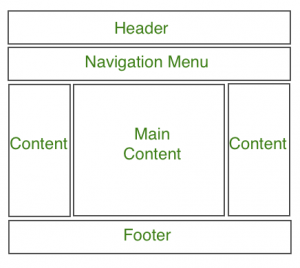

**HTML Layout**

**Introduction:**

HTML layout is the process of structuring web pages to organize content in a visually appealing and user-friendly manner. It involves using various HTML elements to create a logical and hierarchical structure, ensuring that content flows seamlessly and is easy to navigate. In this documentation, we will explore HTML layout concepts using simple words to help you understand the basics of creating effective webpage layouts.



**HTML Layout Elements:**

1. **`<header>`:**

   **Explanation:**
   The `<header>` element represents the top section of a webpage and typically contains the website logo, navigation menus, and other introductory content.

   **Example:**
   ```html
   <header>
     <h1>My Website</h1>
     <nav>
       <ul>
         <li><a href="#home">Home</a></li>
         <li><a href="#about">About</a></li>
         <li><a href="#contact">Contact</a></li>
       </ul>
     </nav>
   </header>
   ```

2. **`<nav>`:**

   **Explanation:**
   The `<nav>` element is used to define a navigation menu, providing links to different pages or sections within the website.

   **Example:**
   ```html
   <nav>
     <ul>
       <li><a href="#home">Home</a></li>
       <li><a href="#about">About</a></li>
       <li><a href="#contact">Contact</a></li>
     </ul>
   </nav>
   ```

3. **`<main>`:**

   **Explanation:**
   The `<main>` element contains the main content of a webpage, excluding headers, footers, and sidebars.

   **Example:**
   ```html
   <main>
     <h2>Welcome to our Website!</h2>
     <p>This is the main content of the page.</p>
   </main>
   ```

4. **`<section>`:**

   **Explanation:**
   The `<section>` element defines a section or block of related content within the webpage.

   **Example:**
   ```html
   <section>
     <h2>About Us</h2>
     <p>We are a team of passionate individuals...</p>
   </section>
   ```

5. **`<article>`:**

   **Explanation:**
   The `<article>` element represents a self-contained piece of content that can be distributed or reused independently, such as a blog post or news article.

   **Example:**
   ```html
   <article>
     <h2>Latest Blog Post</h2>
     <p>Here's our recent blog post content...</p>
   </article>
   ```

6. **`<aside>`:**

   **Explanation:**
   The `<aside>` element is used to define content that is tangentially related to the main content, such as a sidebar or related links.

   **Example:**
   ```html
   <aside>
     <h3>Related Links</h3>
     <ul>
       <li><a href="#link1">Link 1</a></li>
       <li><a href="#link2">Link 2</a></li>
     </ul>
   </aside>
   ```

7. **`<footer>`:**

   **Explanation:**
   The `<footer>` element represents the bottom section of a webpage and usually contains copyright information, contact details, and other closing content.

   **Example:**
   ```html
   <footer>
     <p>&copy; 2023 My Website. All rights reserved.</p>
   </footer>
   ```

**HTML Layout Example:**

Putting it all together, here's an example of a simple webpage layout using the above elements:

```html
<!DOCTYPE html>
<html>
<head>
  <title>My Website</title>
</head>
<body>

  <!-- Header -->
  <header>
    <h1>My Website</h1>
    <nav>
      <ul>
        <li><a href="#home">Home</a></li>
        <li><a href="#about">About</a></li>
        <li><a href="#contact">Contact</a></li>
      </ul>
    </nav>
  </header>

  <!-- Main Content -->
  <main>
    <h2>Welcome to our Website!</h2>
    <p>This is the main content of the page.</p>
    <section>
      <h2>About Us</h2>
      <p>We are a team of passionate individuals...</p>
    </section>
    <article>
      <h2>Latest Blog Post</h2>
      <p>Here's our recent blog post content...</p>
    </article>
  </main>

  <!-- Sidebar (Aside) -->
  <aside>
    <h3>Related Links</h3>
    <ul>
      <li><a href="#link1">Link 1</a></li>
      <li><a href="#link2">Link 2</a></li>
    </ul>
  </aside>

  <!-- Footer -->
  <footer>
    <p>&copy; 2023 My Website. All rights reserved.</p>
  </footer>

</body>
</html>
```

**Summary:**

HTML layout involves structuring web pages using various elements such as `<header>`, `<nav>`, `<main>`, `<section>`, `<article>`, `<aside>`, and `<footer>`. These elements help create a well-organized webpage with clear divisions for different types of content. By understanding and using HTML layout elements effectively, you can create visually appealing and user-friendly websites.