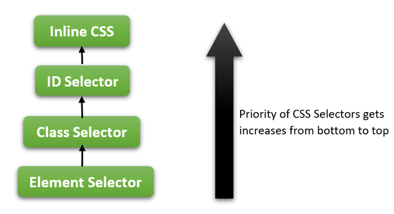

# CSS Selectors Priority Order Tutorial

## Introduction

In CSS, when multiple selectors target the same element and apply conflicting styles, it's essential to understand how the browser determines which style should take precedence. This concept is known as "CSS Selectors Priority Order" or "CSS Specificity." In this tutorial, we'll explore the priority order of CSS selectors to help you understand how styles are applied and resolved.



## Priority Order of CSS Selectors

CSS selectors have different levels of specificity, which determine their priority. The browser uses this priority to resolve conflicting styles. Here's the priority order from the highest to lowest specificity:

1. **Inline Styles:** Styles applied directly to an element using the `style` attribute. Inline styles have the highest specificity because they are considered to be directly applied to the element.

2. **ID Selectors:** Styles applied to elements using their unique ID attributes. IDs have higher specificity than class or type selectors because they are meant to target a single, unique element.

3. **Class Selectors:** Styles applied to elements with specific class attributes. Class selectors have a lower specificity than IDs but higher than type selectors.

4. **Type Selectors:** Styles applied to elements based on their HTML tag names. Type selectors have the lowest specificity among the basic selector types.

5. **Universal Selectors and Attribute Selectors:** Universal selectors (`*`) and attribute selectors (`[attribute]` or `[attribute=value]`) have lower specificity compared to the basic selector types.

6. **Combining Selectors:** When multiple selectors are combined to target an element (e.g., `.class1.class2`), their specificity is calculated based on the sum of individual specificities.

7. **CSS Specificity Hierarchy:** When conflicting styles are applied to the same element, the browser uses the specificity hierarchy to determine which style takes precedence.

## Understanding Specificity Calculation

The specificity of a selector is usually represented as a four-part value, such as `0,0,0,0`. Each part of the value corresponds to the specificity level for inline styles, ID selectors, class selectors, and type selectors, respectively.

When comparing two selectors, the browser will check the values from left to right, and the selector with the highest leftmost value takes precedence. If there's a tie, the selector defined later in the CSS file wins.

## Example:

Let's consider an example to illustrate the priority order of CSS selectors:

**HTML:**
```html
<!DOCTYPE html>
<html>
<head>
    <title>CSS Selectors Priority Example</title>
    <link rel="stylesheet" href="styles.css">
</head>
<body>
    <h1 id="header" class="highlight">Hello, World!</h1>
</body>
</html>
```

**CSS (styles.css):**
```
h1 {
    color: blue;
}

#header {
    color: red;
}

.highlight {
    color: green;
}
```

In this example, the `<h1>` element has three styles targeting it with different specificities. The `h1` type selector sets the text color to blue, the `#header` ID selector sets the text color to red, and the `.highlight` class selector sets the text color to green.

Since the `#header` selector has the highest specificity (1 ID), the text color will be red, overriding the styles applied by the other selectors.

## Summary

Understanding the priority order of CSS selectors is crucial for managing and resolving style conflicts effectively. By considering the specificity hierarchy, you can ensure that the styles you want to apply take precedence over others.

Remember the priority order:
1. Inline Styles
2. ID Selectors
3. Class Selectors
4. Type Selectors
5. Universal and Attribute Selectors