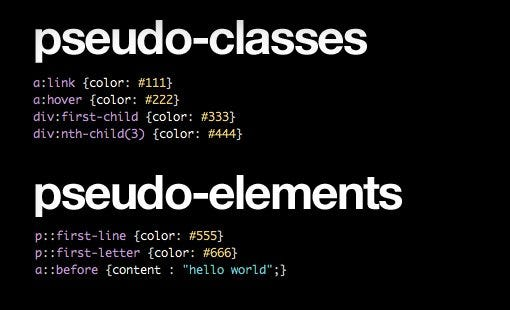

# CSS Pseudo-classes Tutorial

## Introduction to CSS Pseudo-classes

CSS Pseudo-classes are special selectors that target elements based on their state or position in the document. They allow you to apply styles to elements when they are in a particular state, such as when a link is visited or when a user hovers over an element. Pseudo-classes provide a way to add interactivity and dynamic styling to your web pages without the need for JavaScript. In this tutorial, we'll explore six types of CSS Pseudo-classes and provide working examples to help you understand their usage.



## Types of CSS Pseudo-classes

### 1. :hover

The `:hover` pseudo-class targets an element when a user hovers over it with the mouse.

**Syntax:**
```
selector:hover {
    /* styles go here */
}
```

**Example:**
```
/* Change the background color of a button when hovered */
button:hover {
    background-color: lightblue;
}
```

In this example, the `:hover` pseudo-class changes the background color of a button to light blue when the user hovers over it.

### 2. :active

The `:active` pseudo-class targets an element when it is being activated or clicked.

**Syntax:**
```
selector:active {
    /* styles go here */
}
```

**Example:**
```
/* Apply a darker color to a button when it is being clicked */
button:active {
    color: darkblue;
}
```

In this example, the `:active` pseudo-class applies a darker color to a button when it is being clicked.

### 3. :focus

The `:focus` pseudo-class targets an element when it gains focus, such as when a user clicks on an input field.

**Syntax:**
```
selector:focus {
    /* styles go here */
}
```

**Example:**
```
/* Add a border around an input field when it gains focus */
input:focus {
    border: 2px solid blue;
}
```

In this example, the `:focus` pseudo-class adds a blue border around an input field when it gains focus.

### 4. :visited

The `:visited` pseudo-class targets a link that has been visited by the user.

**Syntax:**
```
a:visited {
    /* styles go here */
}
```

**Example:**
```
/* Change the color of visited links to purple */
a:visited {
    color: purple;
}
```

In this example, the `:visited` pseudo-class changes the color of visited links to purple.

### 5. :nth-child()

The `:nth-child()` pseudo-class targets elements based on their position among their siblings.

**Syntax:**
```
selector:nth-child(n) {
    /* styles go here */
}
```

**Example:**
```
/* Apply a different background color to every other row in a table */
tr:nth-child(odd) {
    background-color: lightgray;
}
```

In this example, the `:nth-child(odd)` pseudo-class applies a light gray background color to every other row in a table.

### 6. :not()

The `:not()` pseudo-class targets elements that do not match a specific selector.

**Syntax:**
```
selector:not(another-selector) {
    /* styles go here */
}
```

**Example:**
```
/* Apply a red color to all buttons except the one with class 'primary' */
button:not(.primary) {
    color: red;
}
```

In this example, the `:not(.primary)` pseudo-class applies a red color to all buttons except the ones with the class 'primary'.

## Example Usage
 Below is an HTML code snippet that demonstrates the usage of all types of Pseudo-classes:

```html
<!DOCTYPE html>
<html lang="en">
<head>
    <meta charset="UTF-8">
    <meta name="viewport" content="width=device-width, initial-scale=1.0">
    <title>CSS Pseudo-Classes</title>
    <style>
        /* Pseudo-class :link */
        a:link {
            color: blue;
        }

        /* Pseudo-class :visited */
        a:visited {
            color: purple;
        }

        /* Pseudo-class :hover */
        a:hover {
            background-color: yellow;
        }

        /* Pseudo-class :active */
        a:active {
            color: red;
        }

        /* Pseudo-class :focus */
        input:focus {
            border: 2px solid green;
        }

        /* Pseudo-class :first-child */
        li:first-child {
            font-weight: bold;
        }

        /* Pseudo-class :last-child */
        li:last-child {
            font-style: italic;
        }

        /* Pseudo-class :nth-child(odd) */
        li:nth-child(odd) {
            color: green;
        }

        /* Pseudo-class :nth-child(even) */
        li:nth-child(even) {
            color: blue;
        }

        /* Pseudo-class :not() */
        p:not(.exclude) {
            background-color: pink;
        }
    </style>
</head>
<body>
    <p>Click the links to see the effects of :link and :visited pseudo-classes.</p>
    <ul>
        <li>Item 1</li>
        <li>Item 2</li>
        <li>Item 3</li>
        <li>Item 4</li>
        <li>Item 5</li>
    </ul>
    <input type="text" placeholder="Click here to see the effect of :focus">
    <p class="exclude">This paragraph is excluded from :not() pseudo-class effect.</p>
</body>
</html>
```

Explanation:
- The `:link` pseudo-class is used to style unvisited links with blue color.
- The `:visited` pseudo-class is used to style visited links with purple color.
- The `:hover` pseudo-class is used to add a yellow background when the mouse hovers over a link.
- The `:active` pseudo-class is used to change the color of a link to red when it is being clicked.
- The `:focus` pseudo-class is used to add a green border around an input element when it is focused.
- The `:first-child` pseudo-class is used to make the first list item bold.
- The `:last-child` pseudo-class is used to make the last list item italic.
- The `:nth-child(odd)` pseudo-class is used to apply a green color to odd-indexed list items.
- The `:nth-child(even)` pseudo-class is used to apply a blue color to even-indexed list items.
- The `:not()` pseudo-class is used to apply a pink background to paragraphs that do not have the class "exclude". 
## Summary

CSS Pseudo-classes allow you to apply styles to elements based on their state or position in the document, adding interactivity and dynamic styling to your web pages. By using `:hover`, `:active`, `:focus`, `:visited`, `:nth-child()`, and `:not()`, you can create visually engaging and interactive user experiences.

## Additional Resources

1. [MDN Web Docs - Pseudo-classes](https://developer.mozilla.org/en-US/docs/Web/CSS/Pseudo-classes): This resource from MDN provides detailed explanations and examples of CSS Pseudo-classes.

2. [CSS Tricks - Pseudo-classes](https://css-tricks.com/pseudo-class-selectors/): CSS Tricks offers a comprehensive guide on Pseudo-classes, covering various use cases and creative styling techniques.