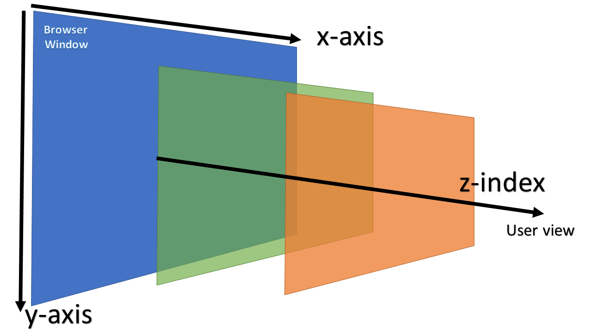

# CSS Positioning Tutorial

## Introduction to CSS Positioning

CSS Positioning is a fundamental concept that allows you to control the layout and positioning of elements on a web page. It enables you to place elements exactly where you want them, relative to their parent container or the browser window. There are several positioning methods in CSS, each with its own characteristics and use cases.



## CSS Positioning Properties

There are four main positioning properties in CSS:

### 1. Static Positioning

The `position: static;` property is the default positioning method for all HTML elements. In static positioning, elements are placed in their natural order within the document flow, and the top, bottom, left, and right properties have no effect.

**Example:**
```
div {
    position: static;
}
```

### 2. Relative Positioning

The `position: relative;` property allows you to position elements relative to their default position within the document flow. By using the top, bottom, left, and right properties, you can move the element in any direction without affecting other elements.

**Example:**
```
div {
    position: relative;
    top: 20px;
    left: 30px;
}
```

### 3. Absolute Positioning

The `position: absolute;` property removes the element from the normal document flow and positions it relative to its closest positioned ancestor. If no ancestor has a positioned property, it is positioned relative to the `<body>` element.

**Example:**
```
div {
    position: absolute;
    top: 50px;
    left: 100px;
}
```

### 4. Fixed Positioning

The `position: fixed;` property positions the element relative to the browser window, regardless of scrolling. It stays fixed at the specified position even when the user scrolls the page.

**Example:**
```
div {
    position: fixed;
    top: 10px;
    right: 20px;
}
```

## Positioning Demo

Let's see a practical example of how different positioning methods work together:

```html
<!DOCTYPE html>
<html>
<head>
    <title>CSS Positioning Demo</title>
    <style>
        body {
            margin: 0;
            padding: 0;
        }

        .container {
            height: 200px;
            width: 200px;
            background-color: lightblue;
            position: relative;
        }

        .box {
            height: 50px;
            width: 50px;
            background-color: red;
            position: absolute;
            top: 50px;
            left: 50px;
        }

        .fixed-box {
            height: 50px;
            width: 50px;
            background-color: green;
            position: fixed;
            bottom: 10px;
            right: 10px;
        }
    </style>
</head>
<body>
    <div class="container">
        <div class="box"></div>
        <div class="fixed-box"></div>
    </div>
</body>
</html>
```

In this example, we have a container with two boxes inside it. The `.box` element is absolutely positioned relative to the `.container`, and the `.fixed-box` element is fixed relative to the browser window.
## Example Usage Code
Below is an HTML code snippet that demonstrates all types of CSS `z-index`, with comments explaining each `z-index` value:

```html
<!DOCTYPE html>
<html lang="en">
<head>
    <meta charset="UTF-8">
    <meta name="viewport" content="width=device-width, initial-scale=1.0">
    <title>CSS z-index</title>
    <style>
        /* Add some basic styles for demonstration purposes */
        body {
            font-family: Arial, sans-serif;
            margin: 0;
            padding: 0;
        }
        .container {
            position: relative;
            height: 400px;
            border: 2px solid #333;
            margin: 20px;
            overflow: hidden; /* To contain absolutely positioned elements */
        }
        .box {
            position: absolute;
            width: 100px;
            height: 100px;
            padding: 10px;
            border: 1px solid #999;
            background-color: #f0f0f0;
            text-align: center;
            font-size: 14px;
            line-height: 1.5;
        }
        .box1 {
            top: 20px;
            left: 20px;
            z-index: 1; /* Lower z-index */
        }
        .box2 {
            top: 50px;
            left: 50px;
            z-index: 2; /* Higher z-index */
        }
        .box3 {
            top: 80px;
            left: 80px;
            z-index: 3; /* Highest z-index */
        }
        .box-auto {
            top: 120px;
            left: 120px;
            /* No z-index specified (default is auto, stacking context based on order in HTML) */
        }
    </style>
</head>
<body>
    <!-- Demonstrating all types of CSS z-index -->

    <div class="container">
        <!-- Box 1 (Lower z-index) -->
        <div class="box box1">
            Box 1 (z-index: 1)
        </div>

        <!-- Box 2 (Higher z-index) -->
        <div class="box box2">
            Box 2 (z-index: 2)
        </div>

        <!-- Box 3 (Highest z-index) -->
        <div class="box box3">
            Box 3 (z-index: 3)
        </div>
    </div>

    <div class="container">
        <!-- Box Auto (Default z-index, stacking context based on order in HTML) -->
        <div class="box box-auto">
            Box Auto (Default z-index)
        </div>
    </div>

</body>
</html>
```

Explanation:
- The `container` class sets some basic styles for the demonstration purposes, including position: relative, height, border, and margin.
- The `box` class represents an absolutely positioned element with specific `z-index` values.
- Each `div` with a specific class (`box1`, `box2`, `box3`, `box-auto`) demonstrates a different `z-index` value.

When you run this HTML code, you will see each box demonstrating different `z-index` values, making it easier to understand how they affect the stacking order of elements on a web page. The element with the highest `z-index` value will be displayed above others within the same stacking context.
## Summary

CSS Positioning is a powerful tool that allows you to control the layout and positioning of elements on your web page. By using `position: static`, `position: relative`, `position: absolute`, and `position: fixed`, you can create complex and dynamic page layouts.

## Additional Resources

1. [MDN Web Docs - CSS Position](https://developer.mozilla.org/en-US/docs/Web/CSS/position): This resource from MDN provides detailed explanations and examples of CSS Positioning.

2. [W3Schools - CSS Layout - Position](https://www.w3schools.com/css/css_positioning.asp): W3Schools offers a comprehensive guide on CSS Positioning, along with interactive examples and exercises to practice your understanding.