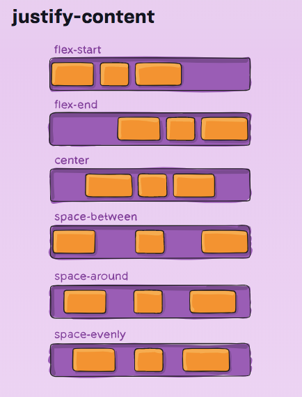

# CSS Flex Layout Tutorial

## Introduction to CSS Flex Layout

CSS Flex Layout (Flexible Box Layout) is a modern and flexible layout model that allows you to create dynamic and responsive layouts with ease. It is designed to distribute and align elements within a container along a single axis (either horizontally or vertically). Understanding CSS Flex Layout is crucial for building adaptive and user-friendly web designs.


## Prerequisites

Before diving into CSS Flex Layout, make sure you have a basic understanding of HTML and CSS. If you need to learn these topics, you can refer to the [HTML Introduction Tutorial](https://example.com/html-introduction) and the [CSS Introduction Tutorial](https://example.com/css-introduction) first.

## Types of CSS Flex Layout

Here are some common CSS Flex Layout techniques and their respective explanations:

### 1. Flex Container - `display: flex`

The `display: flex` property is used to define an element as a flex container. Once an element becomes a flex container, its child elements become flex items, and you can control their alignment and distribution.

**Working Demo:**
```css
.container {
    display: flex;
}
```

**Explanation:**
In this example, the `.container` element will be displayed as a flex container, and its child elements will be arranged along the default main axis (horizontal axis).

### 2. Main Axis Alignment - `justify-content`

The `justify-content` property is used to control the alignment of flex items along the main axis (horizontal axis in the default setting).

**Working Demo:**
```css
.container {
    display: flex;
    justify-content: center;
}
```

**Explanation:**
In this example, the `.container` element will center its child elements along the main axis.

### 3. Cross Axis Alignment - `align-items`

The `align-items` property is used to control the alignment of flex items along the cross axis (vertical axis in the default setting).

**Working Demo:**
```css
.container {
    display: flex;
    align-items: center;
}
```

**Explanation:**
In this example, the `.container` element will center its child elements along the cross axis.

### 4. Flex Item Order - `order`

The `order` property is used to control the order in which flex items appear within the flex container.

**Working Demo:**
```css
.item {
    order: 2;
}
```

**Explanation:**
In this example, the `.item` element will be displayed after other flex items within the container due to its `order` value of 2.

### 5. Flex Item Flexibility - `flex`

The `flex` property is used to control the flexibility and sizing of flex items.

**Working Demo:**
```css
.item {
    flex: 1;
}
```

**Explanation:**
In this example, the `.item` element will grow and shrink to occupy available space, evenly distributing space along with other flex items with `flex: 1`.

## Example Usage
 Here's an example of an HTML code snippet that demonstrates the use of CSS Flexbox layout along with comments to explain each part:

```html
<!DOCTYPE html>
<html>
<head>
    <title>CSS Flexbox Layout Example</title>
    <style>
        /* Flex container styles */
        .flex-container {
            display: flex; /* Use flexbox to create a flex container */
            justify-content: space-between; /* Distribute items with equal space between them */
            align-items: center; /* Align items vertically in the center */
        }

        /* Flex item styles */
        .flex-item {
            background-color: lightblue;
            padding: 20px;
        }
    </style>
</head>
<body>
    <div class="flex-container">
        <!-- Flex Item 1 -->
        <div class="flex-item">
            <p>Flex Item 1</p>
        </div>

        <!-- Flex Item 2 -->
        <div class="flex-item">
            <p>Flex Item 2</p>
        </div>

        <!-- Flex Item 3 -->
        <div class="flex-item">
            <p>Flex Item 3</p>
        </div>
    </div>
</body>
</html>
```

In this example, we use CSS Flexbox layout to create a horizontal row of three flex items:

1. `.flex-container`: This class defines the flex container. We use `display: flex;` to enable flexbox on this container. The `justify-content: space-between;` property evenly distributes the items along the main axis (horizontal) with equal space between them. The `align-items: center;` property aligns the items vertically in the center along the cross axis (vertical).

2. `.flex-item`: This class defines the style for each flex item. We set a light blue background color and add padding to create space around the content.

The three divs with the class `.flex-item` will be arranged horizontally within the `.flex-container` with equal space between them. The content of each flex item will be centered vertically in the container due to the `align-items: center;` property.

The comments in the HTML and CSS code explain the purpose of each part and its contribution to creating the CSS Flexbox Layout.
## Summary


CSS Flex Layout provides a flexible and intuitive way to create dynamic and responsive layouts. By using flex containers and flex item properties like `justify-content`, `align-items`, `order`, and `flex`, you can design adaptive and user-friendly web layouts.

## Additional Resources

1. [MDN Web Docs - CSS Flexbox](https://developer.mozilla.org/en-US/docs/Web/CSS/CSS_Flexible_Box_Layout): This resource from MDN provides detailed explanations and examples of CSS Flexbox.

2. [CSS-Tricks - A Complete Guide to Flexbox](https://css-tricks.com/snippets/css/a-guide-to-flexbox/): This comprehensive guide on CSS-Tricks offers practical examples and use cases for mastering CSS Flexbox.

3. [CSS Flexible Box Layout Module Level 1](https://www.w3.org/TR/css-flexbox-1/): This official documentation from W3C provides an in-depth specification of CSS Flexbox and its properties.