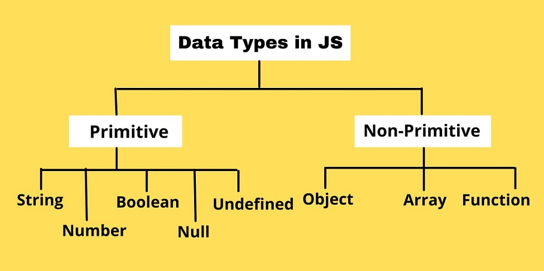

# List of All Data Types in JavaScript

JavaScript has two main categories of data types: primitive and non-primitive (also known as reference) data types. Let's explore each of them in detail.


## Primitive Data Types

Primitive data types are simple data types that represent a single value. They are immutable, meaning their values cannot be changed after they are created. JavaScript has six primitive data types:

1. **Number**: Represents numeric values, including integers and floating-point numbers.

```javascript
// Number data type
const age = 30;

// Output: 30
console.log(age);
```

2. **String**: Represents sequences of characters, enclosed in single or double quotes.

```javascript
// String data type
const name = "John";

// Output: John
console.log(name);
```

3. **Boolean**: Represents a logical value, either `true` or `false`.

```javascript
// Boolean data type
const isStudent = true;

// Output: true
console.log(isStudent);
```

4. **Null**: Represents an intentional absence of any value.

```javascript
// Null data type
const myVariable = null;

// Output: null
console.log(myVariable);
```

5. **Undefined**: Represents a variable that has been declared but not assigned a value.

```javascript
// Undefined data type
let myVar;

// Output: undefined
console.log(myVar);
```

6. **Symbol**: Represents a unique and immutable value used as object property keys.

```javascript
// Symbol data type
const id = Symbol('id');

// Output: Symbol(id)
console.log(id);
```

## Non-Primitive (Reference) Data Types

Non-primitive data types are more complex and can hold references to other values. They are mutable, meaning their values can be changed after they are created. JavaScript has one non-primitive data type:

7. **Object**: Represents a collection of key-value pairs, where values can be of any data type.

```javascript
// Object data type
const person = {
  name: "Alice",
  age: 25,
  isStudent: true
};

// Output: { name: 'Alice', age: 25, isStudent: true }
console.log(person);
```

## Data Types Table

Here's a summary of all the data types in JavaScript:

| Data Type       | Example                  | Description                                                                 |
| --------------- | ------------------------ | --------------------------------------------------------------------------- |
| Number          | `const age = 30;`        | Represents numeric values, including integers and floating-point numbers.   |
| String          | `const name = "John";`   | Represents sequences of characters, enclosed in single or double quotes.    |
| Boolean         | `const isStudent = true;`| Represents a logical value, either `true` or `false`.                       |
| Null            | `const myVar = null;`    | Represents an intentional absence of any value.                             |
| Undefined       | `let myVar;`             | Represents a variable that has been declared but not assigned a value.      |
| Symbol          | `const id = Symbol('id');`| Represents a unique and immutable value used as object property keys.      |
| Object          | `const person = {...};`  | Represents a collection of key-value pairs, where values can be of any type.|

## Summary

In this tutorial, you learned about all the data types in JavaScript, including primitive data types like number, string, boolean, null, undefined, and symbol, as well as the non-primitive data type, object. 
Understanding data types is crucial as it helps you effectively store and manipulate data in your JavaScript programs. Happy coding!

# Type Of Operator in JavaScript

## Introduction

In JavaScript, the `typeof` operator is a useful tool for determining the data type of a value or variable. It allows you to check whether a value is a string, number, boolean, object, function, or one of the other available data types. The `typeof` operator is handy when you need to handle different data types differently in your code. 

In this tutorial, we'll explore the `typeof` operator in JavaScript and learn how to use it effectively.

## Understanding the `typeof` Operator

The `typeof` operator is a built-in operator in JavaScript that returns a string representing the data type of a value or variable. It is written as `typeof value` or `typeof(variable)`, where `value` can be any JavaScript value, and `variable` is the name of the variable you want to check.

## Examples of `typeof` Operator

### 1. String Data Type

```javascript
const name = "John";
const type = typeof name;

// Output: "string"
console.log(type);
```

### 2. Number Data Type

```javascript
const age = 30;
const type = typeof age;

// Output: "number"
console.log(type);
```

### 3. Boolean Data Type

```javascript
const isStudent = true;
const type = typeof isStudent;

// Output: "boolean"
console.log(type);
```

### 4. Object Data Type

```javascript
const person = { name: "Alice", age: 25 };
const type = typeof person;

// Output: "object"
console.log(type);
```

### 5. Undefined Data Type

```javascript
let myVar;
const type = typeof myVar;

// Output: "undefined"
console.log(type);
```

### 6. Function Data Type

```javascript
function greet() {
  console.log("Hello!");
}
const type = typeof greet;

// Output: "function"
console.log(type);
```

## Handling Special Cases

There are some special cases to be aware of when using the `typeof` operator:

### 1. `typeof null` Returns "object"

```javascript
const myVar = null;
const type = typeof myVar;

// Output: "object"
console.log(type);
```

This behavior is considered a historical quirk and is not a true representation of the data type. The `typeof null` returns "object" because in the early days of JavaScript, the data type of objects (including null) was not well-defined.

### 2. `typeof` and Arrays

```javascript
const myArray = [1, 2, 3];
const type = typeof myArray;

// Output: "object"
console.log(type);
```

The `typeof` operator returns "object" for arrays because arrays are considered a type of object in JavaScript. To specifically check for an array, you can use the `Array.isArray()` method.

```javascript
const myArray = [1, 2, 3];
const isArray = Array.isArray(myArray);

// Output: true
console.log(isArray);
```

## Summary

The `typeof` operator in JavaScript is a handy tool for determining the data type of a value or variable. It helps you make informed decisions based on the data type, allowing you to write more robust and flexible code. Understanding the `typeof` operator is crucial for any JavaScript developer, as it enables better handling of data and more effective programming. Happy coding!
