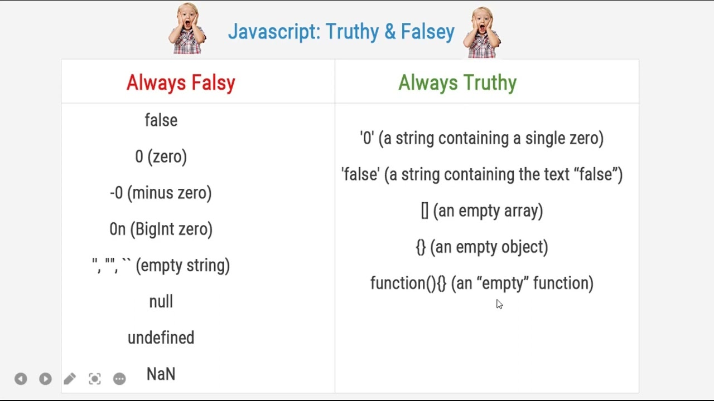

# Truthy and Falsy values in JavaScript

## Introduction

In JavaScript, truthy and falsy values are used to evaluate the truthfulness of expressions in various contexts, such as conditions or logical operations. Understanding truthy and falsy values is important for writing effective and reliable JavaScript code. 
In this tutorial, we'll explore the concept of truthy and falsy values, see how they behave in different situations, and learn how to use them in practical scenarios.


## Truthy and Falsy Values

In JavaScript, all values are either truthy or falsy. A truthy value is a value that evaluates to `true` when used in a boolean context, while a falsy value is a value that evaluates to `false`.

Here is a list of falsy values in JavaScript:

- `false`
- `0` (zero)
- `''` (empty string)
- `null`
- `undefined`
- `NaN` (Not-a-Number)

Any value that is not listed above is considered truthy.

## Truthy and Falsy Values in Conditions

Truthy and falsy values are commonly used in conditional statements (`if`, `else if`, `else`) to control the flow of execution based on certain conditions.

### Example using Truthy and Falsy in Conditions

```javascript
// A function that checks if a value is truthy or falsy
function checkTruthyFalsy(value) {
  if (value) {
    console.log(`${value} is truthy.`);
  } else {
    console.log(`${value} is falsy.`);
  }
}

// Testing different values
checkTruthyFalsy(true); // Output: true is truthy.
checkTruthyFalsy(10); // Output: 10 is truthy.
checkTruthyFalsy('Hello'); // Output: Hello is truthy.
checkTruthyFalsy([]); // Output:  is truthy.
checkTruthyFalsy({}); // Output: [object Object] is truthy.
checkTruthyFalsy(null); // Output: null is falsy.
checkTruthyFalsy(undefined); // Output: undefined is falsy.
checkTruthyFalsy(''); // Output:  is falsy.
checkTruthyFalsy(0); // Output: 0 is falsy.
checkTruthyFalsy(NaN); // Output: NaN is falsy.
```

## Truthy and Falsy in Logical Operations

Truthy and falsy values are also important in logical operations like `&&` (AND) and `||` (OR).

### Example using Truthy and Falsy in Logical Operations

```javascript
// Logical AND (&&) Operator
console.log(true && 'Hello'); // Output: Hello
console.log(false && 'Hello'); // Output: false

// Logical OR (||) Operator
console.log(true || 'Hello'); // Output: true
console.log(false || 'Hello'); // Output: Hello
```

## Practical Use Cases

Truthy and falsy values are commonly used for setting default values and handling optional parameters in functions.

### Example using Truthy and Falsy in Practical Use Cases

```javascript
// Setting default value using Logical OR (||) Operator
function greetUser(name) {
  name = name || 'Guest';
  console.log(`Hello, ${name}!`);
}

greetUser(); // Output: Hello, Guest!
greetUser('Alice'); // Output: Hello, Alice!

// Handling optional parameter using Logical AND (&&) Operator
function displayMessage(message) {
  message && console.log(`Message: ${message}`);
}

displayMessage(); // No output, as message is falsy (undefined)
displayMessage('Hello, world!'); // Output: Message: Hello, world!
```

## Summary

In this tutorial, we explored the concept of truthy and falsy values in JavaScript. Understanding truthy and falsy values is crucial for making decisions in your code using conditions and logical operations. These values provide a convenient way to handle default values and optional parameters in functions, improving the flexibility and readability of your code. 
Being familiar with truthy and falsy values will help you write more reliable and concise JavaScript applications. Happy coding!