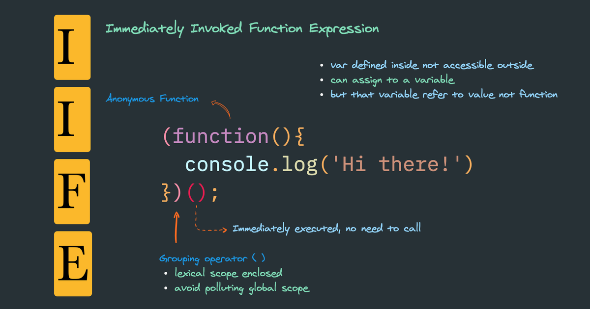

# Functions in Depth in JavaScript

Functions are blocks of code that perform specific tasks or calculations and can be used repeatedly throughout your JavaScript code. They allow you to break down your code into smaller, reusable pieces, making it easier to manage and maintain. 

Functions are a fundamental concept in JavaScript programming, and understanding them in-depth is crucial for writing efficient and organized code. 
In this tutorial, we'll explore various ways to declare functions in JavaScript and understand the differences between them.

## Declaration of Functions

In JavaScript, you can declare functions using different syntaxes. Let's go through each of them:

### 1. Function Declaration

The most common way to declare a function is using the function declaration syntax:

### Syntax

```javascript
function functionName(parameters) {
  // Function body
  // Code to be executed
  return value; // Optional
}
```
Example:
```javascript
// Function Declaration
function add(a, b) {
  return a + b;
}

// Calling the function and storing the result in a variable
const sum = add(2, 3);

// Output: 5
console.log(sum);
```

### When to Use

Function declarations are preferred when you need to define reusable functions that can be called multiple times throughout your code. They are hoisted, which means they can be used before their declaration.

### 2. Function Expression

Another way to declare a function is through a function expression:

### Syntax

```javascript
const functionName = function (parameters) {
  // Function body
  // Code to be executed
  return value; // Optional
};
```
Example:
```javascript
// Function Expression
const subtract = function(a, b) {
  return a - b;
};

// Calling the function and storing the result in a variable
const result = subtract(5, 2);

// Output: 3
console.log(result);
```

### When to Use

Function expressions are useful when you want to create functions as values assigned to variables. They can be used in places where you would use any other value or data type.

### 3. Anonymous Function

An anonymous function is a function without a name, often used as a callback or immediately invoked:

### Syntax

```javascript
function (parameters) {
  // Function body
  // Code to be executed
  return value; // Optional
}
```
Example:
```javascript
// Anonymous Function as a callback
const numbers = [1, 2, 3];

numbers.forEach(function(num) {
  console.log(num);
});

// Output:
// 1
// 2
// 3
```

### When to Use

Anonymous functions are commonly used as callback functions for events, timers, or array methods like `map`, `filter`, and `forEach`.

### 4. Immediately Invoked Function Expression (IIFE)

An IIFE is a function that is executed immediately after its creation:


### Syntax

```javascript
(function (parameters) {
  // Function body
  // Code to be executed
  return value; // Optional
})(arguments);
```
Example:

```javascript
// IIFE
(function() {
  const message = "Hello, world!";
  console.log(message);
})();

// Output: "Hello, world!"
```

### When to Use

IIFEs are often used to create a private scope, avoid polluting the global scope, and execute code immediately without leaving any variables behind.


### 5. Arrow Function

Arrow functions are a concise way to declare functions and automatically bind the `this` context:

### Syntax

```javascript
const functionName = (parameters) => {
  // Function body
  // Code to be executed
  return value; // Optional
};
```

```javascript
// Arrow Function
const square = (num) => num * num;

// Calling the function and storing the result in a variable
const squaredValue = square(4);

// Output: 16
console.log(squaredValue);
```
### When to Use

Arrow functions are useful when writing short, one-line functions or when you want to preserve the `this` value lexically.


## Function Return

Functions can return values using the `return` keyword. If a function does not have a `return` statement, it implicitly returns `undefined`.

```javascript
function greet(name) {
  return `Hello, ${name}!`;
}

const greeting = greet("Alice");

// Output: "Hello, Alice!"
console.log(greeting);
```

## Function Parameters and Arguments

Function parameters are placeholders for values that a function expects to receive when called. Arguments are the actual values passed to a function when it is invoked.

```javascript
function greet(firstName, lastName) {
  return `Hello, ${firstName} ${lastName}!`;
}

const fullName = greet("John", "Doe");

// Output: "Hello, John Doe!"
console.log(fullName);
```

## Summary

In this tutorial, we explored various ways to declare functions in JavaScript, including function declarations, function expressions, anonymous functions, immediately invoked function expressions (IIFE), and arrow functions. 

Understanding how to declare and use functions effectively is essential for writing modular and maintainable JavaScript code. Functions allow you to encapsulate logic, improve code reusability, and organize your programs in a more structured manner. Happy coding!


