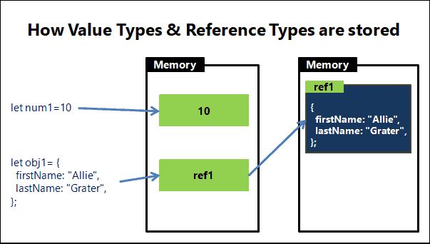

# Value Types and Reference Types in JavaScript

## Introduction

In JavaScript, variables can hold two different types of data: value types (also known as primitive types) and reference types (also known as objects). Understanding the difference between value types and reference types is crucial for working with variables and objects effectively in JavaScript. 
In this tutorial, we'll explore value types and reference types, provide example snippets with comments, and present a detailed comparison table to help you understand their characteristics.


## Value Types (Primitive Types)

Value types represent simple data types that store their value directly in the variable. They are called "primitive types" because they hold the actual value itself. The value types in JavaScript are:

- **Number:** Represents numeric values, such as integers or floating-point numbers.
- **String:** Represents textual data, enclosed in single or double quotes.
- **Boolean:** Represents a binary value, `true` or `false`.
- **Undefined:** Represents a variable that has been declared but not assigned a value.
- **Null:** Represents the intentional absence of any object value.
- **Symbol (ES6):** Represents a unique and immutable value that can be used as an object property.

### Example for Value Types

```javascript
// Number
let num = 10;

// String
let message = "Hello, JavaScript!";

// Boolean
let isLogged = true;

// Undefined
let x;

// Null
let person = null;
```

## Reference Types (Objects)

Reference types represent complex data types that store a reference to the memory location where the data is stored. They are called "reference types" because the variable holds a reference (address) to the actual object in memory. The reference types in JavaScript are:

- **Object:** Represents a collection of key-value pairs (properties and methods).
- **Array:** Represents an ordered list of values.
- **Function:** Represents a callable object that can contain code.
- **Date:** Represents a date and time value.
- **RegExp:** Represents a regular expression pattern.
- **Custom Objects:** User-defined objects created using constructors or classes.

### Example for Reference Types

```javascript
// Object
let personObj = { name: "Alice", age: 30 };

// Array
let numbers = [1, 2, 3, 4, 5];

// Function
function sayHello() {
  console.log("Hello!");
}

// Date
let today = new Date();

// RegExp
let pattern = /hello/gi;

// Custom Object
class Book {
  constructor(title, author) {
    this.title = title;
    this.author = author;
  }
}

let myBook = new Book("The Great Gatsby", "F. Scott Fitzgerald");
```

## Comparison Table: Value Types vs. Reference Types

| Aspect                 | Value Types (Primitive Types)      | Reference Types (Objects)                      |
| ---------------------- | --------------------------------- | --------------------------------------------- |
| Stored Value           | The actual value itself          | A reference (address) to the actual object   |
| Memory Management      | Stored directly in the variable   | Stored in the heap memory                     |
| Copying Variables      | Creates an independent copy       | Creates a copy of the reference, not the object itself |
| Comparison             | Compare the value directly        | Compare the references (addresses)            |
| Equality Comparison    | Compares the values               | Compares the references (addresses)           |
| Modification           | Cannot be modified (immutable)    | Can be modified (mutable)                     |
| Examples               | Numbers, Strings, Booleans, etc.  | Objects, Arrays, Functions, Date, RegExp, etc. |

## Example Snippets of printing value and reference type

```javascript
// Output for Value Types
console.log(num); // Output: 10
console.log(message); // Output: Hello, JavaScript!
console.log(isLogged); // Output: true
console.log(x); // Output: undefined
console.log(person); // Output: null

// Output for Reference Types
console.log(personObj); // Output: { name: "Alice", age: 30 }
console.log(numbers); // Output: [1, 2, 3, 4, 5]
sayHello(); // Output: Hello!
console.log(today); // Output: (current date and time)
console.log(pattern); // Output: /hello/gi
console.log(myBook); // Output: Book { title: "The Great Gatsby", author: "F. Scott Fitzgerald" }
```

## Summary

In this tutorial, we explored value types (primitive types) and reference types (objects) in JavaScript. Value types store the actual value directly in the variable, while reference types store a reference to the memory location where the data is stored. 
Understanding the differences between value types and reference types is essential for working with variables and objects effectively in JavaScript.