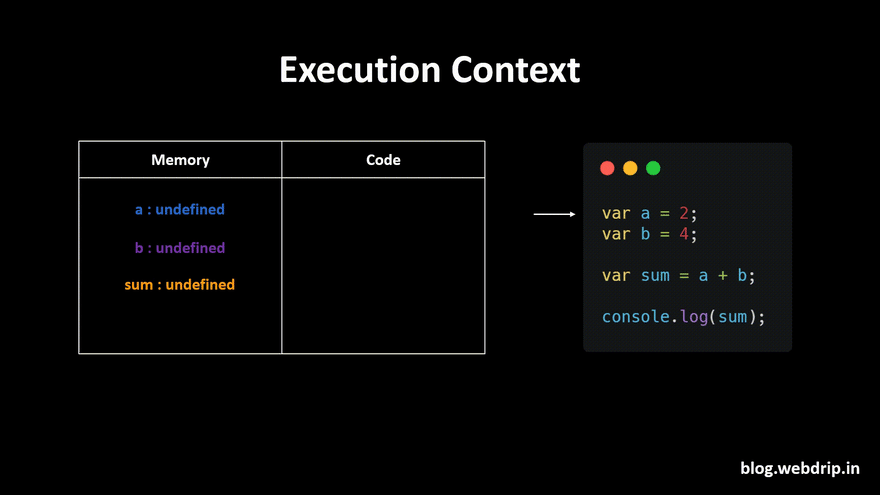

# Hoisting in JavaScript

## Introduction

Hoisting is a JavaScript behavior where variable and function declarations are moved to the top of their containing scope during the compilation phase before the code is executed. This means that you can use variables and functions before they are actually declared in your code. Understanding hoisting is essential for avoiding unexpected behaviors and writing clean and organized JavaScript code. 

In this tutorial, we'll explore hoisting in detail and cover the various types of hoisting with examples.


## Definition of Hoisting

In JavaScript, hoisting is a mechanism where variable and function declarations are moved to the top of their containing scope during the compilation phase, while the assignments and initializations stay in their original place during the execution phase.

## Types of Hoisting

There are two main types of hoisting in JavaScript:

1. **Variable Hoisting:** Variable declarations (not assignments) are hoisted to the top of their scope.
2. **Function Hoisting:** Function declarations (not function expressions) are hoisted to the top of their scope.

Let's explore each type of hoisting with examples:

### 1. Variable Hoisting

```javascript
console.log(x); // Output: undefined (variable 'x' is hoisted with the value undefined)

var x = 10; // Variable declaration (hoisted to the top)
console.log(x); // Output: 10
```

Explanation: In the first `console.log()`, the variable `x` is hoisted and declared at the top of its containing scope (global scope in this case) but without a value. So, accessing the variable before its assignment results in `undefined`. In the second `console.log()`, `x` has been assigned the value `10`.

### 2. Function Hoisting

```javascript
sayHello(); // Output: Hello!

function sayHello() {
  console.log("Hello!");
}
```

Explanation: The function `sayHello()` is hoisted to the top of its containing scope (global scope in this case). So, even though the function is called before its actual declaration, it works perfectly fine.

### 3. Hoisting within Blocks

```javascript
function hoistingExample() {
  if (true) {
    // Variable hoisting within a block
    var a = 1;
  }
  console.log(a); // Output: 1 (variable 'a' is hoisted within the block scope)
}

hoistingExample();
```

Explanation: Although the variable `a` is declared within a block using `var`, it is hoisted to the top of its containing function scope (the `hoistingExample()` function). Therefore, it can be accessed even outside the block scope.

## Summary

In this tutorial, we explored hoisting in JavaScript, which is the process of moving variable and function declarations to the top of their containing scope during the compilation phase. We learned about the two main types of hoisting: variable hoisting and function hoisting. 
Understanding hoisting is crucial for writing reliable and organized JavaScript code. 