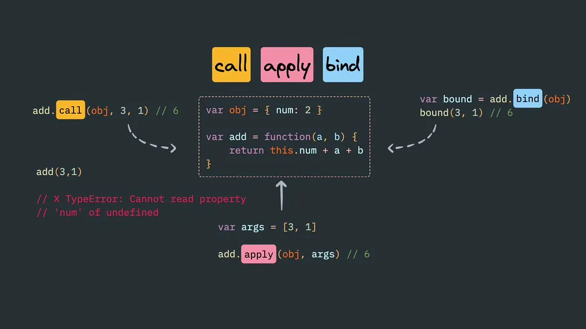

# Call, Bind, and Apply in JavaScript

## Introduction

In JavaScript, `call`, `bind`, and `apply` are methods that allow you to control the context (the value of `this`) and arguments of a function during its execution. They are useful when you want to invoke a function with a specific `this` value and provide arguments explicitly. Understanding how to use `call`, `bind`, and `apply` is essential for writing clean and efficient JavaScript code. 
In this tutorial, we'll explore these methods in detail, provide example code snippets with comments, and explain their usage.


## Call Method

The `call` method allows you to invoke a function with a specified `this` value and pass arguments individually as a list.

### Example Code Snippet for Call

```javascript
const person = {
  name: "Alice",
  sayHello: function (greeting) {
    console.log(`${greeting}, ${this.name}!`);
  },
};

const anotherPerson = {
  name: "Bob",
};

person.sayHello("Hi"); // Output: Hi, Alice!

person.sayHello.call(anotherPerson, "Hello"); // Output: Hello, Bob!
```

Explanation: In this example, `person` has a method `sayHello`, which uses `this.name` to access the `name` property of the `person` object. When calling `person.sayHello("Hi")`, `this` refers to the `person` object, and the output is "Hi, Alice!". However, when using `call` with `person.sayHello.call(anotherPerson, "Hello")`, `this` is explicitly set to `anotherPerson`, resulting in the output "Hello, Bob!".

## Bind Method

The `bind` method returns a new function with the specified `this` value and any additional arguments fixed (predefined).

### Example Code Snippet for Bind

```javascript
const person = {
  name: "Alice",
  sayHello: function (greeting) {
    console.log(`${greeting}, ${this.name}!`);
  },
};

const anotherPerson = {
  name: "Bob",
};

const boundFunction = person.sayHello.bind(anotherPerson, "Hi");

boundFunction(); // Output: Hi, Bob!
```

Explanation: In this example, `person` has a method `sayHello`. We use the `bind` method to create a new function `boundFunction`, where `this` is explicitly set to `anotherPerson`, and the first argument is fixed as "Hi". When calling `boundFunction()`, it uses the predefined `this` value and the fixed argument to output "Hi, Bob!".

## Apply Method

The `apply` method allows you to invoke a function with a specified `this` value and pass arguments as an array.

### Example Code Snippet for Apply

```javascript
const person = {
  name: "Alice",
  sayHello: function (greeting, adjective) {
    console.log(`${greeting}, ${adjective} ${this.name}!`);
  },
};

const anotherPerson = {
  name: "Bob",
};

const args = ["Hi", "awesome"];

person.sayHello.apply(anotherPerson, args); // Output: Hi, awesome Bob!
```

Explanation: In this example, `person` has a method `sayHello`, which takes two arguments (`greeting` and `adjective`). We use the `apply` method to invoke `person.sayHello` with `this` set to `anotherPerson` and pass the arguments as an array `args`. The output is "Hi, awesome Bob!".

## Summary

In this tutorial, we explored `call`, `bind`, and `apply` in JavaScript, which are methods that allow you to control the context (`this` value) and arguments of a function during its execution. 
`call` is used to invoke a function with a specific `this` value and individual arguments. 
`bind` returns a new function with the specified `this` value and fixed arguments. 
`apply` is used to invoke a function with a specific `this` value and arguments passed as an array. 

Understanding the usage of `call`, `bind`, and `apply` is essential for writing clean and efficient JavaScript code, especially when you need to work with context and arguments dynamically. Happy coding!