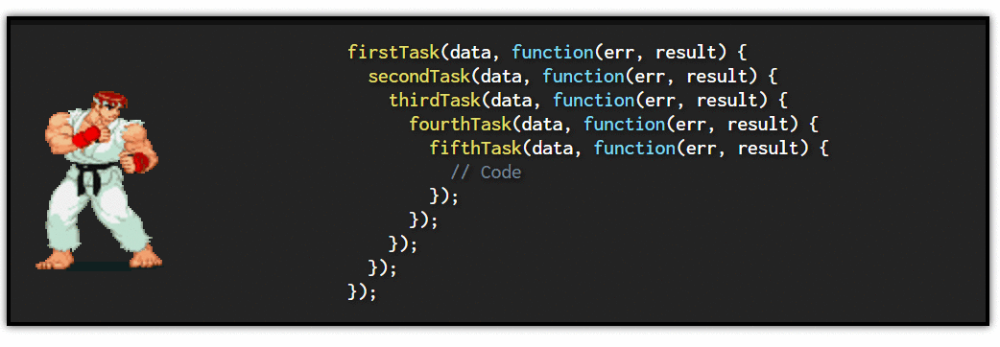

# Understanding Callbacks and Callback Hell in JavaScript: A Comprehensive Guide

## Introduction

Callbacks are a fundamental concept in JavaScript, allowing you to execute a function after another function has finished its task. They are especially useful when dealing with asynchronous operations, such as network requests or file reading, where the result is not immediately available. However, nested callbacks can lead to a phenomenon known as "Callback Hell," making code hard to read and maintain. In this tutorial, we will explore the definitions, syntax, and examples of callbacks and callback hell, and provide explanations on when to use callbacks in JavaScript.


## Callbacks

### Definition and Syntax

A callback is a function that is passed as an argument to another function and is executed after that function has completed its task.

```javascript
function doSomethingAsync(callback) {
  // Simulate an asynchronous operation with setTimeout
  setTimeout(() => {
    console.log("Async operation completed");
    callback();
  }, 1000);
}
```

In the code above, `doSomethingAsync` is a function that takes a `callback` as an argument. After simulating an asynchronous operation with `setTimeout`, the `callback` function is called to indicate that the operation has completed.

### Example

```javascript
function greet(name, callback) {
  const greeting = `Hello, ${name}!`;
  callback(greeting);
}

function displayGreeting(message) {
  console.log(message);
}

greet("John", displayGreeting);
```

In the code above, the `greet` function takes two arguments: `name` and `callback`. After constructing the greeting message, it calls the `callback` function with the greeting as an argument. The `displayGreeting` function is passed as the callback, which logs the greeting to the console.

## When to Use Callbacks

Callbacks are commonly used in scenarios where the result of an operation is not immediately available, such as:

1. **Asynchronous Operations:** When dealing with asynchronous tasks, like network requests or file reading, callbacks allow you to handle the result once it becomes available.

2. **Event Handling:** In event-driven programming, callbacks are used to respond to events, such as button clicks or user interactions.

3. **Control Flow:** Callbacks are used to control the flow of code execution, ensuring specific tasks occur after others.

## Callback Hell

Callback hell, also known as the pyramid of doom, occurs when multiple nested callbacks are used, making the code hard to read and maintain. It often arises when dealing with complex asynchronous operations.



### Example

```javascript
asyncOperation1(function () {
  asyncOperation2(function () {
    asyncOperation3(function () {
      // ... more nested callbacks ...
    });
  });
});
```

In the code above, multiple nested callbacks are used to handle asynchronous operations, creating a callback hell. This can lead to reduced code readability and make it difficult to understand the control flow.

## Summary

Callbacks are essential in JavaScript for handling asynchronous operations and controlling the flow of code execution. They allow you to execute functions once specific tasks are completed, making them ideal for event handling and asynchronous operations.

However, care should be taken to avoid callback hell by using techniques like Promises, async/await, or modularizing code. These approaches help maintain code readability and improve the overall structure of your JavaScript applications.

By understanding and effectively using callbacks while avoiding callback hell, you can build more responsive, efficient, and maintainable JavaScript applications. Happy coding!