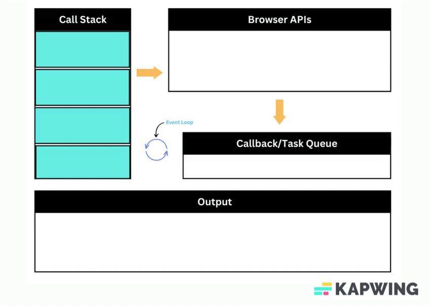

# Async Programming Summary: Difference between Callbacks, Promises, Async, and Await in JavaScript

## Introduction

Asynchronous programming is a crucial aspect of JavaScript, especially when dealing with time-consuming tasks such as network requests or file operations. Over time, different approaches have been developed to handle asynchronous operations more efficiently and maintainably. In this tutorial, we will summarize and compare the four common methods for async programming in JavaScript: Callbacks, Promises, Async, and Await. We'll use a table format to present the differences and provide simple explanations for each.



## Comparison Table

| Method     | Definition                                                    | Use Case                                                                                    | Syntax                                                                                       |
| ---------- | ------------------------------------------------------------- | ------------------------------------------------------------------------------------------- | -------------------------------------------------------------------------------------------- |
| Callbacks  | A function passed as an argument and executed after a task   | Handling asynchronous operations in older JavaScript code                                   | ```javascript function doSomethingAsync(callback) { ... callback(); } ```                     |
| Promises   | An object representing the eventual completion of a task     | Handling asynchronous operations with clean, structured code                               | ```javascript const promise = new Promise((resolve, reject) => { ... resolve(value); }); ```  |
| Async      | A keyword used to declare a function for asynchronous tasks | Simplifying asynchronous code and making it look synchronous                                 | ```javascript async function fetchData() { ... await someAsyncTask(); } ```                   |
| Await      | A keyword used inside an async function to pause execution   | Waiting for a Promise to resolve before proceeding to the next line of code                 | ```javascript const result = await someAsyncTask(); ```                                       |

## Explanation

1. **Callbacks:**
   - Callbacks are an older method for handling asynchronous operations in JavaScript.
   - They are functions passed as arguments to other functions and executed once the task is completed.
   - The main drawback of callbacks is that they can lead to "Callback Hell" when multiple nested callbacks are used, making the code hard to read and maintain.
   - Callbacks are still used in some scenarios, but they are not the preferred method for modern asynchronous programming.

2. **Promises:**
   - Promises are an improvement over callbacks, providing a more structured and organized way to handle asynchronous operations.
   - They represent the eventual completion (or failure) of a task and allow chaining `.then()` and `.catch()` methods to handle the results or errors.
   - Promises are widely used in modern JavaScript applications due to their clean and readable syntax, making code more maintainable.

3. **Async:**
   - The `async` keyword is used before a function declaration to indicate that the function contains asynchronous operations.
   - Async functions return Promises implicitly, making them compatible with Promises and existing asynchronous APIs.
   - The main advantage of async functions is that they allow you to write asynchronous code in a more synchronous-like style, making it easier to read and understand.

4. **Await:**
   - The `await` keyword is used inside an async function to pause the execution of the function until a Promise is resolved.
   - It allows you to avoid nested callbacks and write more linear and readable code.
   - Await can only be used inside async functions.

## Summary

In this summary, we compared four different methods for async programming in JavaScript: Callbacks, Promises, Async, and Await. While callbacks were an older approach, Promises, Async, and Await provide more structured and readable ways to work with asynchronous tasks. Promises and Async/Await are widely used in modern JavaScript applications due to their clean and organized syntax, making it easier to handle asynchronous operations and avoiding callback hell.

By understanding the differences between these methods, you can choose the most appropriate approach for your asynchronous programming needs and write more efficient, maintainable, and readable JavaScript code. Happy coding!