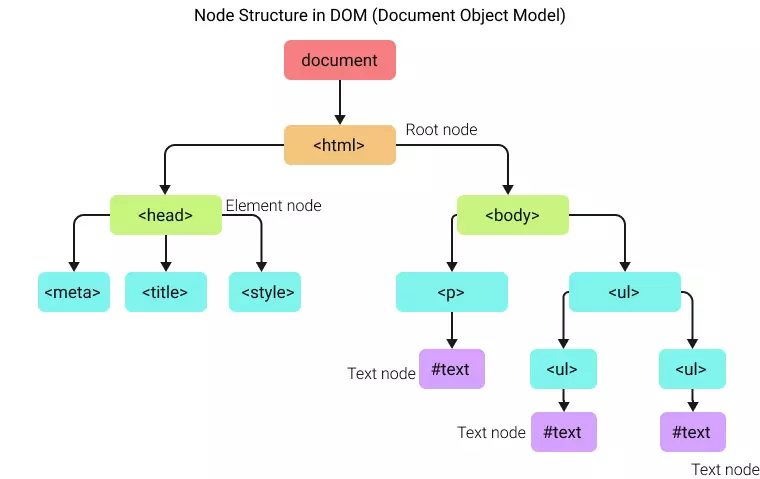

# Understanding DOM Nodes and Collections

## Introduction

In the Document Object Model (DOM), nodes represent elements, attributes, and text within an HTML or XML document. Nodes form a hierarchical tree structure, where each node can have child nodes and, in some cases, a parent node. DOM collections are array-like objects that store multiple nodes, making it easier to work with groups of elements in the document. Understanding DOM nodes and collections is crucial for web development, as they form the basis for manipulating and interacting with the content of a web page. In this tutorial, we will explore the definitions and explanations of DOM nodes and collections, provide example code snippets with comments, explain when to use them, and use simple words to explain the concepts.



## DOM Nodes

### Definition and Explanation

In the DOM, nodes represent individual elements, attributes, and text within an HTML or XML document. Each node is an object with properties and methods that allow you to interact with it. The DOM organizes nodes into a hierarchical tree structure, with the `document` object at the root and various elements, attributes, and text nodes as its descendants.

There are different types of nodes in the DOM:

1. **Element Nodes:** Represent HTML elements, such as `<div>`, `<p>`, ``, etc. They can have child nodes, attributes, and text content.

2. **Attribute Nodes:** Represent attributes of HTML elements. For example, the `href` attribute of an anchor (`<a>`) element.

3. **Text Nodes:** Represent text content within an HTML element.

4. **Comment Nodes:** Represent comments within an HTML document.

Each node in the DOM tree has relationships with other nodes:

- Parent Node: The node that is one level above the current node in the tree.
- Child Node: The node that is one level below the current node in the tree.
- Sibling Nodes: Nodes that share the same parent node.

### Example Code Snippet

```html
<!DOCTYPE html>
<html>
<head>
  <title>DOM Nodes Example</title>
</head>
<body>
  <div id="container">
    <p>Hello, <span id="name">John</span>!</p>
  </div>

  <script>
    // Accessing DOM nodes
    const containerNode = document.getElementById("container");
    const nameNode = document.getElementById("name");
    const paragraphNode = nameNode.parentNode;
    const spanNode = paragraphNode.querySelector("span");

    // Modifying text content
    nameNode.textContent = "Jane";

    // Creating a new element
    const newElement = document.createElement("p");
    newElement.textContent = "This is a new paragraph.";
    containerNode.appendChild(newElement);

    // Removing an element
    containerNode.removeChild(spanNode);
  </script>
</body>
</html>
```

### When to Use DOM Nodes

Use DOM nodes when you need to:

1. Access and modify the content and structure of an HTML document dynamically.
2. Traverse the DOM tree to find specific elements or perform actions based on their relationships.
3. Create new elements and add them to the document on the fly.
4. Remove elements or modify their attributes and text content.

DOM nodes are the building blocks for creating interactive and dynamic web pages. They enable developers to manipulate the content and appearance of the document in response to user actions or application logic.

## DOM Collections

### Definition and Explanation

DOM collections are array-like objects that store multiple nodes, allowing you to work with groups of elements in the document. Common examples of DOM collections include `HTMLCollection` and `NodeList`. They are typically returned by DOM methods like `getElementsByTagName`, `getElementsByClassName`, `querySelectorAll`, etc.

DOM collections are similar to arrays in that they have a length property and can be iterated using a loop. However, unlike arrays, DOM collections do not have all the array methods, so they are not true arrays.

### Example Code Snippet

```html
<!DOCTYPE html>
<html>
<head>
  <title>DOM Collections Example</title>
</head>
<body>
  <ul>
    <li class="item">Item 1</li>
    <li class="item">Item 2</li>
    <li class="item">Item 3</li>
  </ul>

  <script>
    // Accessing DOM collections
    const itemList = document.getElementsByClassName("item");

    // Iterating over DOM collection
    for (let i = 0; i < itemList.length; i++) {
      console.log(itemList[i].textContent);
    }
  </script>
</body>
</html>
```

### When to Use DOM Collections

Use DOM collections when you need to:

1. Access multiple elements that share the same tag name or class name.
2. Perform the same operation on a group of elements, such as changing their styles or attributes.
3. Iterate over a collection of nodes to perform specific actions or gather information.

DOM collections are handy when you want to work with multiple elements at once without needing to access each element individually. They streamline the process of interacting with groups of nodes, making your code more concise and efficient.

## Summary

DOM nodes and collections are essential concepts in web development for manipulating and interacting with the content of an HTML document. Nodes represent individual elements, attributes, and text, while collections store groups of nodes, enabling you to work with multiple elements at once. By understanding DOM nodes and collections, you can build dynamic and interactive web pages with ease, providing a seamless user experience. Happy coding!