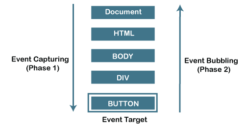

# DOM Events in JavaScript: An in depth guide

## Introduction

DOM events in JavaScript allow you to handle interactions and actions performed by users on an HTML document. Events are actions like clicking a button, hovering over an element, submitting a form, and more. Understanding DOM events is crucial for building interactive and responsive web applications. In this tutorial, we will explore DOM events in JavaScript, explain event bubbling, delegation, and capturing phases, and provide example code snippets with comments to explain each concept.



## Handling DOM Events

To handle DOM events, you can use the `addEventListener` method to attach an event listener to an element. The event listener is a JavaScript function that gets executed when the specified event occurs on the element. Here's an example:

```html
<!DOCTYPE html>
<html>
<head>
  <title>Handling DOM Events</title>
</head>
<body>
  <button id="myButton">Click Me</button>

  <script>
    // Find the element
    const buttonElement = document.getElementById("myButton");

    // Add an event listener
    buttonElement.addEventListener("click", function() {
      alert("Button clicked!");
    });
  </script>
</body>
</html>
```

In the example above, we have a button element with the ID "myButton." Using `addEventListener`, we attach a "click" event listener to the button. When the button is clicked, the specified function is executed, showing an alert with the message "Button clicked!"

## Event Bubbling

Event bubbling is a concept in which an event is triggered on an element, and then it propagates upward through its ancestors in the DOM tree until it reaches the document root. This means that when you interact with an element, the event will also be triggered on its parent elements and so on. Here's an example to illustrate event bubbling:

```html
<!DOCTYPE html>
<html>
<head>
  <title>Event Bubbling</title>
</head>
<body>
  <div id="outer">
    <div id="inner">
      <button id="myButton">Click Me</button>
    </div>
  </div>

  <script>
    // Find the elements
    const outerElement = document.getElementById("outer");
    const innerElement = document.getElementById("inner");
    const buttonElement = document.getElementById("myButton");

    // Add event listeners
    outerElement.addEventListener("click", function() {
      console.log("Clicked on outer element");
    });

    innerElement.addEventListener("click", function() {
      console.log("Clicked on inner element");
    });

    buttonElement.addEventListener("click", function() {
      console.log("Button clicked!");
    });
  </script>
</body>
</html>
```

In the example above, we have three nested elements: the outer `<div>`, the inner `<div>`, and the button. When you click the button, the event will bubble up and trigger event listeners on both the inner and outer elements.

## Event Delegation

Event delegation is a technique that leverages event bubbling to handle events on multiple elements efficiently. Instead of attaching individual event listeners to each element, you can attach a single event listener to a parent element and handle events for all its descendants. Here's an example to demonstrate event delegation:

```html
<!DOCTYPE html>
<html>
<head>
  <title>Event Delegation</title>
</head>
<body>
  <ul id="myList">
    <li>Item 1</li>
    <li>Item 2</li>
    <li>Item 3</li>
  </ul>

  <script>
    // Find the parent element
    const listElement = document.getElementById("myList");

    // Add event listener to the parent
    listElement.addEventListener("click", function(event) {
      // Check if the clicked element is an <li> element
      if (event.target.tagName === "LI") {
        console.log("Clicked on item: " + event.target.textContent);
      }
    });
  </script>
</body>
</html>
```

In the example above, we have a `<ul>` element with three `<li>` elements as its children. Instead of attaching separate event listeners to each `<li>` element, we attach a single event listener to the parent `<ul>` element. When an `<li>` element is clicked, the event bubbles up and triggers the event listener on the parent. We then check if the clicked element is an `<li>` element and handle the event accordingly.

## Event Capturing Phase

Event capturing is the opposite of event bubbling. It occurs before the event reaches the target element, starting from the document root and moving towards the target element. To use event capturing, you can set the third parameter of `addEventListener` to `true`. However, event capturing is less commonly used compared to event bubbling.

## Summary

In this tutorial, you learned about handling DOM events in JavaScript, event bubbling, event delegation, and the capturing phase. By understanding these concepts, you can build interactive and responsive web applications that respond to user interactions and provide a seamless user experience. Happy coding!