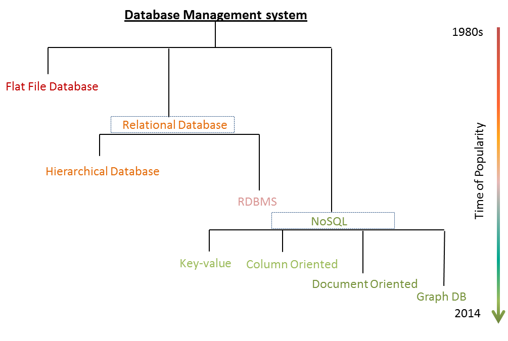

# Evolution of Database Management Systems (DBMS): Tracing the Journey

The evolution of technology has paved the way for significant advancements in the realm of Database Management Systems (DBMS). In this tutorial, we embark on a journey through time to explore the fascinating evolution of DBMS, from its early origins to the modern systems we rely on today.



## Pre-Relational Era

### Hierarchical and Network Models

Before the advent of relational databases, early systems utilized hierarchical and network data models. These models organized data in a tree-like or interconnected structure, respectively. They were efficient for certain types of applications but lacked the flexibility and scalability demanded by modern systems.

```plaintext
// Example of a hierarchical model
|-- Department
|   |-- Employee
|   |-- Employee
|-- Department
    |-- Employee
```

```plaintext
// Example of a network model
NODE Employee
  CHILD Employee
  CHILD Employee
  CHILD Department
    CHILD Employee
```

## The Birth of Relational Databases

### Relational Model and SQL

The 1970s saw the rise of the relational model, introduced by E.F. Codd. This model organized data into tables with rows and columns, providing a clear and intuitive way to manage structured data. SQL (Structured Query Language) emerged as the standardized language for querying and manipulating relational databases.

```sql
-- Example of creating a table in SQL
CREATE TABLE Customers (
    CustomerID INT PRIMARY KEY,
    FirstName VARCHAR(50),
    LastName VARCHAR(50)
);
```

## The Rise of Commercial DBMS

### Client-Server Architecture

In the 1980s and 1990s, the client-server architecture became prominent. Commercial DBMS like Oracle, IBM DB2, and Microsoft SQL Server dominated the scene. These systems introduced features like ACID transactions, data integrity constraints, and improved query optimization.

```plaintext
// Example of client-server architecture
[Client] <-> [Application Server] <-> [Database Server]
```

## Emergence of NoSQL Databases

### NoSQL Paradigm

As applications evolved, the limitations of relational databases became evident for certain use cases, such as massive-scale web applications. This led to the rise of NoSQL databases in the 2000s. NoSQL databases, including document stores, key-value stores, column-family stores, and graph databases, focused on flexibility and scalability.

```plaintext
// Example of NoSQL document model
{
    "_id": "12345",
    "firstName": "John",
    "lastName": "Doe",
    "age": 30
}
```

## Modern DBMS Landscape

### NewSQL and Graph Databases

In recent years, NewSQL databases have emerged, combining the scalability of NoSQL with the familiarity of SQL. Additionally, graph databases gained popularity for applications involving complex relationships, such as social networks and recommendation engines.

```sql
-- Example of graph database query language (Cypher)
MATCH (user:User)-[:FOLLOWS]->(friend:User)
WHERE user.name = "John"
RETURN friend.name;
```

## Cloud-Native Databases

### Cloud Database Services

The shift towards cloud computing introduced cloud-native databases. Managed database services like Amazon RDS, Azure SQL Database, and Google Cloud SQL allow developers to focus on applications while the cloud provider handles database maintenance.

```plaintext
// Cloud-native database deployment
[Application] <-> [Managed Database Service]
```

## Summary

The evolution of DBMS has been a remarkable journey, from hierarchical and network models to the relational paradigm, and then to NoSQL and specialized databases. Today, we stand at the crossroads of advanced NewSQL systems, graph databases, and cloud-native services. This evolution reflects the continuous effort to meet the diverse demands of modern applications, providing data management solutions that empower developers and organizations to innovate and thrive.