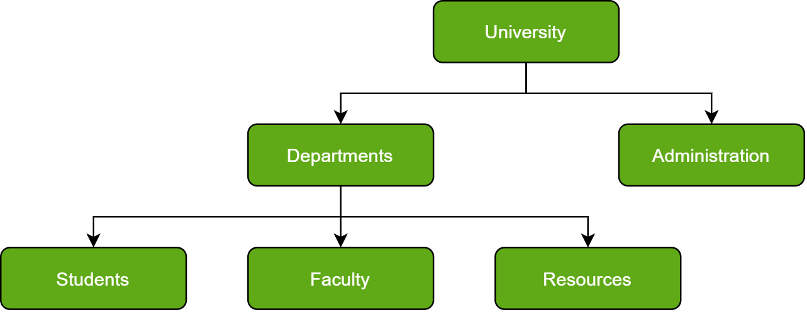
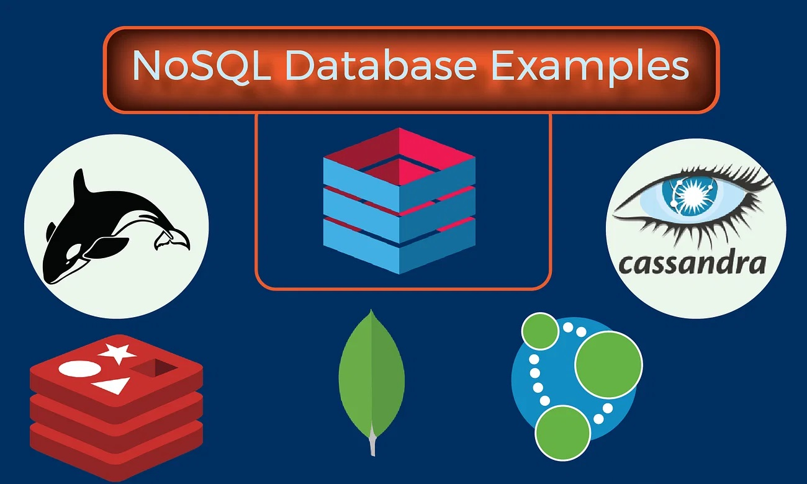
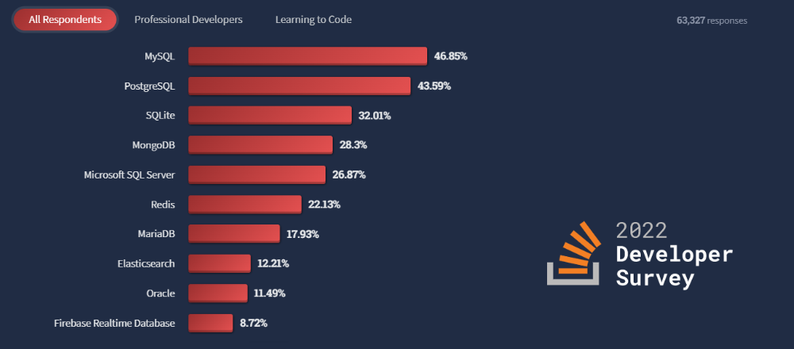

# A Comprehensive Tutorial on Different Types of Databases

Databases play a crucial role in modern computing, and there are several types of databases, each designed to serve specific needs and data management requirements. In this tutorial, we will explore eight different types of databases:

1. **Hierarchical Databases**

   **Description:** Hierarchical databases are one of the oldest database models and organize data in a tree-like structure with a single root, parent-child relationships, and multiple levels of child nodes. Each node can have one parent but multiple children.

   

   **Characteristics:**
   - Data is organized in a tree structure.
   - Efficient for representing one-to-many relationships.
   - Widely used in early database systems.

   **Use Cases:**
   - File systems
   - Organizational charts

   **Examples:**
   - IMS (Information Management System)

2. **Network Databases**

   **Description:** Network databases extend the hierarchical model by allowing multiple parent-child relationships. They use pointers or references to connect records in a network-like structure.

   

   **Characteristics:**
   - Data is organized as a graph-like structure.
   - Allows many-to-many relationships.
   - Used for complex data relationships.

   **Use Cases:**
   - Engineering and CAD systems
   - Parts and suppliers inventory

   **Examples:**
   - IDMS (Integrated Database Management System)
   - DMS-1100

3. **Object-Oriented Databases**

   **Description:** Object-oriented databases store data as objects, similar to how programming languages define objects. These databases are designed to handle complex data structures and support object-oriented principles like inheritance and encapsulation.

   

   **Characteristics:**
   - Data is stored as objects with attributes and methods.
   - Supports object-oriented modeling and design.
   - Ideal for complex data relationships.

   **Use Cases:**
   - Software engineering (e.g., object persistence)
   - Multimedia applications

   **Examples:**
   - ObjectDB
   - ZODB (Zope Object Database)

4. **Relational Databases**

   **Description:** Relational databases are the most widely used database type. They store data in structured tables with rows and columns and use SQL for data manipulation. The relational model emphasizes the use of keys and relationships to maintain data integrity.

   

   **Characteristics:**
   - Data is organized in tables with predefined schemas.
   - Utilizes structured query language (SQL).
   - Supports data integrity through constraints.

   **Use Cases:**
   - Business applications
   - Financial systems
   - E-commerce platforms

   **Examples:**
   - MySQL
   - PostgreSQL
   - Oracle Database
   - Microsoft SQL Server

5. **NoSQL Databases**

   **Description:** NoSQL databases (which stands for "not only SQL") encompass various database models that do not rely on the traditional relational model. They are designed to handle unstructured, semi-structured, or rapidly changing data.

   

   **Characteristics:**
   - Diverse data models (document, key-value, column-family, graph).
   - Flexible schema or schema-less.
   - Suited for handling big data and real-time data.

   **Use Cases:**
   - Web applications
   - Big data analytics
   - IoT applications

   **Examples:**
   - MongoDB (Document)
   - Redis (Key-Value)
   - Apache Cassandra (Column-Family)
   - Neo4j (Graph)

6. **Distributed Databases**

   **Description:** Distributed databases span multiple locations or nodes, allowing data to be stored across multiple servers or data centers. These databases offer advantages like high availability, fault tolerance, and scalability.

   **Characteristics:**
   - Data is distributed across multiple locations.
   - Provides fault tolerance and load balancing.
   - Supports data replication and partitioning.

   **Use Cases:**
   - Cloud-based applications
   - Global enterprises with multiple branches
   - Content delivery networks (CDNs)

   **Examples:**
   - Amazon Aurora
   - Google Cloud Spanner
   - CockroachDB

7. **In-Memory Databases**

   **Description:** In-memory databases primarily store data in system memory (RAM) rather than on disk. This results in exceptionally fast data access and retrieval times.

   **Characteristics:**
   - Data resides in memory for rapid access.
   - Ideal for low-latency data processing.
   - Commonly used for caching and real-time analytics.

   **Use Cases:**
   - Caching
   - Real-time analytics
   - Gaming

   **Examples:**
   - Redis (can function as an in-memory database)
   - Memcached
   - Apache Ignite

8. **Spatial Databases**

   **Description:** Spatial databases are specialized databases designed for storing, retrieving, and analyzing spatial or geographic data. They incorporate spatial data types and support spatial indexing and queries.

   **Characteristics:**
   - Stores geographic and spatial data types.
   - Supports spatial indexing and queries.
   - Essential for location-aware applications.

   **Use Cases:**
   - Geographic information systems (GIS)
   - Navigation systems
   - Geospatial data analysis

   **Examples:**
   - PostGIS (extension for PostgreSQL)
   - Oracle Spatial and Graph
   - MongoDB (with spatial features)

In conclusion, the choice of a database type depends on the specific requirements of your application and the nature of the data you need to store and retrieve. Understanding the characteristics and use cases of these various database types will help you make informed decisions when selecting the most suitable database for your project.
