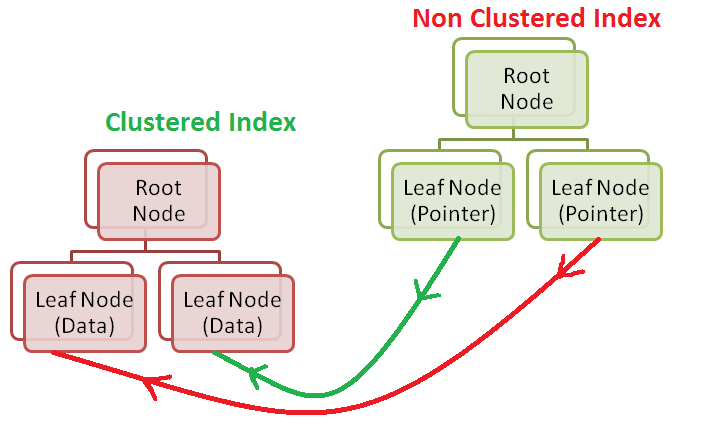

# Indexing in DBMS: A Comprehensive Tutorial

## Introduction to Indexing in DBMS

**Indexing** is a fundamental concept in database management systems (DBMS). It's a technique that significantly improves the efficiency of data retrieval operations by providing a fast and efficient way to locate specific rows within a database table. In this comprehensive tutorial, we'll explore what indexing is, why it's essential, how it works, types of indexes, and best practices for using indexing in a DBMS.

## What is Indexing?

In a DBMS, an **index** is a data structure that enhances the speed of data retrieval operations on a database table at the cost of additional storage space and maintenance overhead. Indexes are akin to the index of a book, which allows you to quickly locate information in the book without having to read every page sequentially.

## Why is Indexing Important?

1. **Improved Query Performance:** Indexes make data retrieval operations significantly faster, especially when dealing with large datasets. Without indexes, the database engine would have to scan the entire table, which can be inefficient and time-consuming.

2. **Faster Sorting:** Indexes facilitate quick sorting of data based on the indexed columns. This is especially important for operations like ordering query results.

3. **Enforcement of Uniqueness:** Indexes can enforce uniqueness constraints, ensuring that data in a column (or combination of columns) is unique across the table.

4. **Optimized Joins:** When performing joins between multiple tables, indexes on the join columns improve join performance dramatically.

## How Indexing Works

Indexing works by creating a separate data structure that stores a subset of the table's columns and their corresponding row identifiers. These row identifiers typically point to the actual rows in the table.

When you execute a query that involves a column with an index, the database engine consults the index rather than scanning the entire table. This leads to a substantial reduction in the number of disk I/O operations and a significant improvement in query speed.

## Types of Indexes

There are several types of indexes in DBMS, each suited to specific use cases. Some common types include:

1. **Single-Column Index:** This index is created on a single column. It's the most basic type of index and is used when queries predominantly involve that column.

2. **Composite Index (Multi-Column Index):** This index involves multiple columns and is used when queries involve combinations of those columns. The order of columns in a composite index matters; it affects how efficiently the index is used for various queries.

3. **Unique Index:** A unique index enforces uniqueness constraints on one or more columns, ensuring that no two rows in the indexed columns have the same values.

4. **Clustered Index:** In databases that support clustered indexes (e.g., SQL Server), the data rows themselves are stored in the order defined by the index. Each table can have only one clustered index.

5. **Non-Clustered Index:** These indexes are separate from the actual data rows and contain a pointer to the data rows. A table can have multiple non-clustered indexes.

6. **Full-Text Index:** Used for text-based searching, full-text indexes allow you to perform text searches efficiently. They are common in search engines and document management systems.

## Best Practices for Using Indexing

1. **Identify the Right Columns:** Choose columns for indexing based on the types of queries your application will execute frequently. Indexing every column is not always the best strategy, as it can increase storage requirements and slow down data modification operations.

2. **Use Composite Indexes Wisely:** When creating composite indexes, consider the order of columns. Place columns that are frequently used in filtering conditions first.

3. **Monitor Index Usage:** Regularly monitor the performance of your indexes to identify unused or redundant indexes. Removing unnecessary indexes can improve data modification operations.

4. **Regular Maintenance:** Indexes can become fragmented over time due to data modifications. Schedule regular index maintenance tasks to rebuild or reorganize indexes.

5. **Consider Database Design:** Properly designed database schemas can reduce the need for excessive indexing. Normalize your data, use appropriate data types, and avoid duplicate data.

6. **Test Query Performance:** Before implementing indexes, test query performance with and without indexes to ensure that they are indeed improving performance.

7. **Plan for Growth:** Consider the expected growth of your database. Indexing strategies that work well for small datasets may not be suitable for large datasets.

## Summary

Indexing is a vital technique in DBMS that enhances query performance, sorting, and data retrieval operations. By understanding the types of indexes, best practices for their use, and their impact on database performance, you can effectively design and manage indexes to optimize the performance of your database-driven applications.