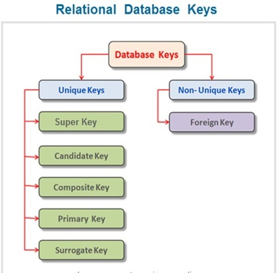

# Understanding DBMS Keys: A Comprehensive Guide to Data Integrity

In the world of Database Management Systems (DBMS), **keys** play a pivotal role in ensuring data integrity and facilitating efficient data retrieval. This tutorial takes a deep dive into the world of DBMS keys, explaining their types, significance, and practical applications, equipping you with the knowledge to design well-structured and reliable databases.

## What are DBMS Keys?

DBMS keys are fundamental components that help uniquely identify records within a database table. They play a vital role in maintaining data integrity, enforcing relationships, and optimizing query performance.



## Key Types

### Primary Key

A **primary key** uniquely identifies each record in a table. It ensures that no two records have the same key value and serves as the main identifier for data retrieval and modification.

```sql
-- Example of primary key (SQL)
CREATE TABLE Students (
    StudentID INT PRIMARY KEY,
    FirstName VARCHAR(50),
    LastName VARCHAR(50),
    -- ...
);
```

### Foreign Key

A **foreign key** establishes a link between tables, ensuring referential integrity. It refers to the primary key of another table and maintains relationships.

```sql
-- Example of foreign key (SQL)
CREATE TABLE Enrollments (
    EnrollmentID INT PRIMARY KEY,
    StudentID INT,
    CourseID INT,
    -- ...
    FOREIGN KEY (StudentID) REFERENCES Students(StudentID),
    FOREIGN KEY (CourseID) REFERENCES Courses(CourseID)
);
```

### Candidate Key

A **candidate key** is a column or set of columns that could potentially serve as a primary key. It satisfies the uniqueness and not-null requirements.

### Super Key

A **super key** is a set of one or more columns that, when combined, can uniquely identify a record. It might include extra columns that are not strictly necessary for uniqueness.

### Alternate Key

An **alternate key**, also known as a unique key, is a candidate key that is not chosen as the primary key. It offers an alternative means of uniquely identifying records.

### Composite Key

A **composite key** is a key that consists of multiple columns. The combination of these columns ensures uniqueness.

## Importance of DBMS Keys

- **Data Integrity:** Keys enforce uniqueness, preventing duplicate or inconsistent data.

- **Relationships:** Foreign keys establish relationships between tables, maintaining referential integrity.

- **Efficient Retrieval:** Properly indexed keys improve query performance and data retrieval.

- **Normalization:** Keys play a role in database normalization by reducing redundancy.

## Practical Usage of DBMS Keys

- **Primary Keys:** Identify unique records, often used in JOIN operations and to retrieve specific data.

- **Foreign Keys:** Create relationships between tables, ensuring consistency across related data.

- **Candidate and Alternate Keys:** Assist in the design phase to determine the primary key.

- **Composite Keys:** Useful when a single column cannot guarantee uniqueness.

## Summary

In this in-depth guide, we've navigated through the realm of DBMS keys, understanding their types, significance, and practical applications. By grasping the concept of primary keys, foreign keys, candidate keys, and more, you're empowered to design databases that maintain data integrity, establish relationships, and enable efficient data retrieval. As you venture into the world of database design and management, the knowledge of DBMS keys will prove invaluable in creating reliable and optimized systems.