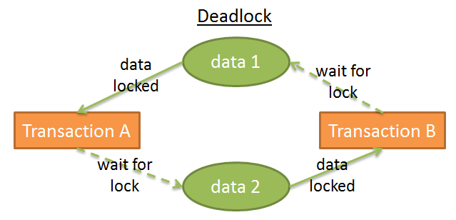

# DBMS Deadlocks: Navigating Concurrent Operations Standstill

In the realm of Database Management Systems (DBMS), **Deadlocks** stand as a challenging scenario where transactions become stuck in a state of standstill, unable to proceed due to conflicting resource requests. This comprehensive tutorial delves deep into the world of DBMS deadlocks, explaining their concepts, causes, detection, and resolution strategies. By the end of this guide, you'll be well-equipped to design systems that mitigate the risk of deadlocks and recover gracefully when they occur.

## What are DBMS Deadlocks?

DBMS deadlocks occur when two or more transactions are blocked, each waiting for a resource that's held by another transaction within the same group. This situation leads to a standstill where none of the transactions can proceed.

## Key Concepts of DBMS Deadlocks

### Resource Types

Resources can include data objects, memory space, locks, and other system resources.

### Deadlock Causes

Deadlocks can occur due to these conditions:

- **Mutual Exclusion:** Resources cannot be shared simultaneously.

- **Hold and Wait:** Transactions hold resources while waiting for others.

- **No Preemption:** Resources cannot be forcibly taken from transactions.

- **Circular Wait:** Transactions form a circular chain, each waiting for the next.

### Detection and Resolution

Detection involves identifying deadlocks, while resolution aims to break the deadlock and allow transactions to proceed.

### Timeout and Rollback

A transaction can be forcibly terminated if it exceeds a specified time limit.

### Wait-for Graph

A graph that represents the wait-for relationships among transactions.

## Strategies for Deadlock Prevention and Handling

### Deadlock Prevention

- **Mutual Exclusion:** Ensure resources can be shared.

- **Hold and Wait:** Require transactions to request all needed resources at once.

- **No Preemption:** Allow resources to be preempted if needed.

- **Circular Wait:** Impose an order for resource request to break the circular wait.

### Deadlock Handling

- **Timeouts:** Set a timeout for transactions to release resources and retry.

- **Rollback:** Rollback one or more transactions to a safe point to resolve the deadlock.

- **Wait-Die and Wound-Wait Schemes:** Allow younger transactions to wait (Wait-Die) or older transactions to be aborted (Wound-Wait).

## Benefits of Managing DBMS Deadlocks

- **System Reliability:** Deadlock management ensures the system doesn't become unresponsive.

- **Data Integrity:** Graceful deadlock resolution prevents data inconsistencies.

## Practical Usage of Deadlock Management

- **Database Systems:** Ensuring that database transactions don't deadlock when accessing shared resources.

- **Operating Systems:** Managing resource allocation among multiple processes.

## Summary

In this comprehensive guide, we've delved into the intricate world of DBMS deadlocks, understanding their causes, detection, and strategies for prevention and resolution. By grasping the concepts of resource types, deadlock causes, detection methods, and prevention strategies, you're equipped to design systems that effectively manage and recover from deadlocks. As you navigate the complexities of concurrent transactions, the knowledge of deadlock management will serve as a crucial tool in building robust and responsive systems that ensure data integrity and maintain system availability.