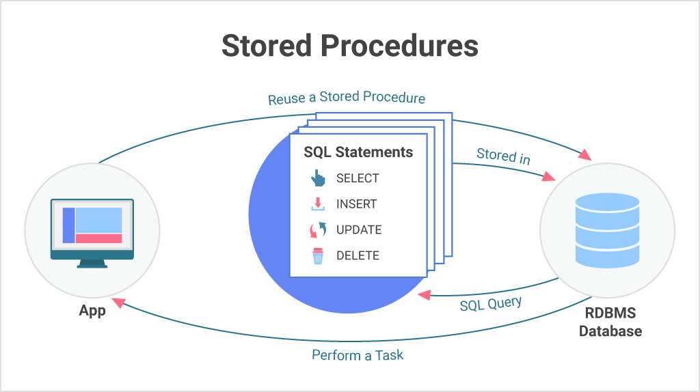

# MySQL Stored Procedures: Streamlining Database Logic and Reusability

Stored Procedures in MySQL provide a powerful way to encapsulate and execute complex database logic. This comprehensive tutorial delves into the world of MySQL stored procedures, covering essential concepts, creation, parameters, and practical examples. By the end of this guide, you'll be adept at designing and utilizing stored procedures to enhance your database management and development processes.


## Understanding Stored Procedures in MySQL

Stored Procedures in MySQL are sets of SQL statements that can be executed as a single unit, simplifying complex operations and promoting reusability.

## Key Concepts of Stored Procedures in MySQL

### Creating a Stored Procedure

```sql
-- Creating a stored procedure
DELIMITER //
CREATE PROCEDURE get_employee_details(IN emp_id INT)
BEGIN
    SELECT * FROM employees WHERE id = emp_id;
END;
//
DELIMITER ;
```

### Parameters in Stored Procedures

```sql
-- Stored procedure with parameters
DELIMITER //
CREATE PROCEDURE update_employee_salary(IN emp_id INT, IN new_salary DECIMAL(10, 2))
BEGIN
    UPDATE employees SET salary = new_salary WHERE id = emp_id;
END;
//
DELIMITER ;
```

### Calling Stored Procedures

```sql
-- Calling a stored procedure
CALL get_employee_details(101);

-- Calling a stored procedure with parameters
CALL update_employee_salary(102, 50000.00);
```

### Dropping Stored Procedures

```sql
-- Dropping a stored procedure
DROP PROCEDURE get_employee_details;
```

## Benefits of Using Stored Procedures in MySQL

- **Modular Database Logic:** Stored procedures help organize complex logic into manageable units.

- **Enhanced Security:** Access to data is controlled through stored procedures, reducing direct query exposure.

- **Reusability:** Stored procedures can be called from different parts of your application, reducing redundant code.


## Summary

In this comprehensive guide, we've explored MySQL stored procedures, understanding their significance and practical applications. By grasping the concepts of procedure creation, parameter usage, and calling procedures, you're empowered to streamline complex database operations and promote code reusability within your MySQL environment. As you work on database management and application development, the knowledge of stored procedures in MySQL will serve as a valuable asset in enhancing efficiency, security, and maintainability in your database systems.