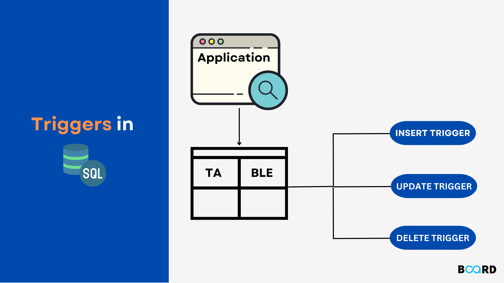

# MySQL Triggers: Automating Actions for Enhanced Database Management

Triggers in MySQL are powerful tools that allow you to automate actions based on changes in your database. This comprehensive tutorial dives into the world of MySQL triggers, covering essential concepts, trigger types, and practical examples. By the end of this guide, you'll have a solid grasp of how to utilize triggers to streamline your database management processes.


## Understanding Triggers in MySQL

Triggers in MySQL are database objects that execute automatically in response to specified events, such as INSERT, UPDATE, DELETE operations on tables.

## Key Concepts of Triggers in MySQL

### Creating a Trigger

```sql
-- Creating a trigger
DELIMITER //
CREATE TRIGGER after_insert_employee
AFTER INSERT ON employees
FOR EACH ROW
BEGIN
    INSERT INTO audit_log (event_type, event_time, table_name, row_id)
    VALUES ('INSERT', NOW(), 'employees', NEW.id);
END;
//
DELIMITER ;
```

### Trigger Types: BEFORE and AFTER

```sql
-- BEFORE trigger
CREATE TRIGGER before_update_salary
BEFORE UPDATE ON employees
FOR EACH ROW
BEGIN
    IF NEW.salary < 0 THEN
        SIGNAL SQLSTATE '45000'
        SET MESSAGE_TEXT = 'Salary cannot be negative';
    END IF;
END;
```

### Using OLD and NEW

```sql
-- Using OLD and NEW
CREATE TRIGGER after_update_employee
AFTER UPDATE ON employees
FOR EACH ROW
BEGIN
    IF NEW.department <> OLD.department THEN
        INSERT INTO department_changes (employee_id, old_department, new_department)
        VALUES (NEW.id, OLD.department, NEW.department);
    END IF;
END;
```

### Dropping Triggers

```sql
-- Dropping a trigger
DROP TRIGGER after_insert_employee;
```

## Benefits of Using Triggers in MySQL

- **Automated Actions:** Triggers enable you to automate complex actions based on data changes.

- **Data Validation:** Triggers help enforce data validation rules at the database level.

- **Audit Trail:** Utilize triggers to maintain an audit trail of changes made to the database.

## Practical Usage of Triggers in MySQL

- **Logging and Auditing:** Implement triggers to track changes for auditing purposes.

## Summary

In this comprehensive guide, we've explored MySQL triggers, understanding their significance and practical applications. By grasping the concepts of trigger creation, types, and utilization of OLD and NEW references, you're empowered to automate actions and enforce data integrity within your MySQL database. As you work on database management and data tracking, the knowledge of triggers in MySQL will serve as a powerful tool in automating tasks and maintaining a reliable and well-controlled database environment.