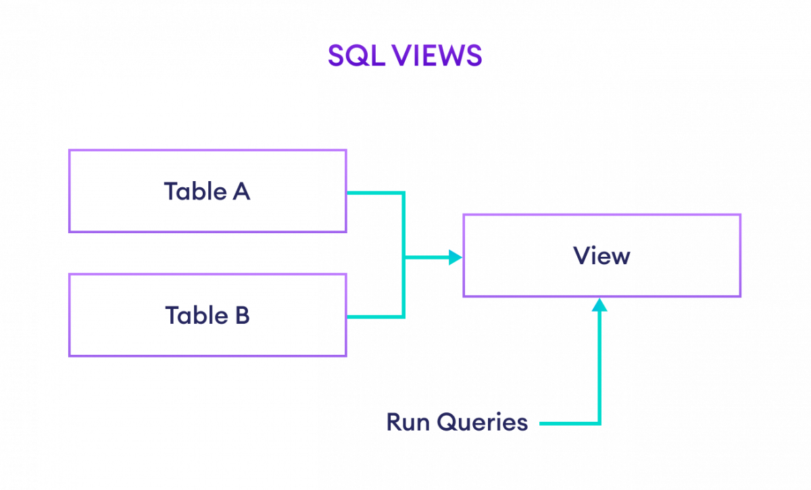

# MySQL Views: Simplifying Data Retrieval and Enhancing Security

Views in MySQL offer a versatile way to simplify complex queries, enhance data security, and provide a convenient abstraction layer. This comprehensive tutorial delves into the world of MySQL views, covering essential concepts, creation, advantages, and practical examples. By the end of this guide, you'll be well-versed in creating and utilizing views to optimize your data retrieval processes.


## Understanding Views in MySQL

Views in MySQL are virtual tables created by defining a query, enabling you to access and manipulate data without altering the underlying tables.

## Key Concepts of Views in MySQL

### Creating a View

```sql
-- Creating a view
CREATE VIEW employee_details AS
SELECT id, first_name, last_name, department
FROM employees
WHERE age > 30;
```

### Retrieving Data from a View

```sql
-- Retrieving data from a view
SELECT * FROM employee_details;
```

### Updating Data Through a View

```sql
-- Updating data through a view
UPDATE employee_details
SET department = 'Marketing'
WHERE id = 101;
```

### Dropping a View

```sql
-- Dropping a view
DROP VIEW employee_details;
```

### Joining Tables in a View

```sql
-- Creating a view with a join
CREATE VIEW customer_order AS
SELECT customers.name, orders.order_date
FROM customers
JOIN orders ON customers.id = orders.customer_id;
```

## Benefits of Using Views in MySQL

- **Simplified Queries:** Views encapsulate complex queries, making data retrieval more straightforward.

- **Data Security:** Views can limit access to specific columns, enhancing data security.

- **Abstraction Layer:** Views provide an abstraction layer, shielding users from underlying table structure changes.
## Summary

In this comprehensive guide, we've delved into MySQL views, understanding their significance and practical applications. By grasping the concepts of view creation, data retrieval, and data manipulation through views, you're empowered to simplify complex queries and enhance data security within your MySQL environment. As you work on optimizing data retrieval processes and ensuring data privacy, the knowledge of views in MySQL will serve as a valuable asset in providing a convenient and secure way to access and interact with your database.