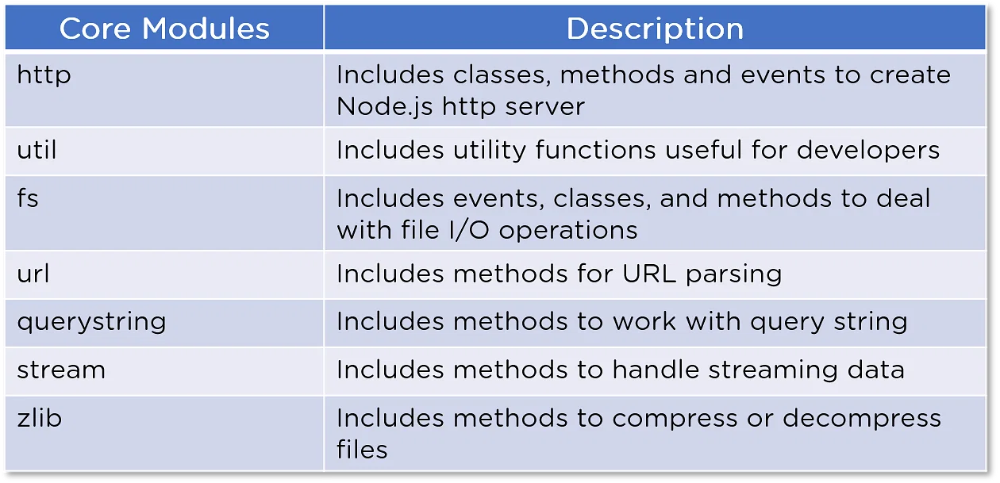

# Node.js Modules: Your Guide to Organized Code

Node.js modules are essential for structuring and organizing your codebase. In this comprehensive tutorial, we'll take you through the world of Node.js modules, explaining their importance, how to create and use them, and practical examples. By the end of this guide, you'll have a solid understanding of how to modularize your Node.js applications for improved maintainability and scalability.


## Node.js Modules: A Deep Dive

Node.js modules allow you to break your code into reusable and maintainable components.

## Key Concepts of Node.js Modules

### Creating a Module

To create a module, simply define your functions, variables, or classes in a `.js` file.

```javascript
// Example of a module named "math.js"
const add = (a, b) => a + b;
const subtract = (a, b) => a - b;

module.exports = { add, subtract };
```

### Using a Module

To use a module, require it in your code and access its exported functions or variables.

```javascript
// Using the "math" module
const math = require('./math');

console.log(math.add(5, 3));      // Output: 8
console.log(math.subtract(10, 4)); // Output: 6
```

### Core Modules vs. Custom Modules

Node.js provides core modules (e.g., `http`, `fs`) and allows you to create custom modules.

### Folder Modules

Organize related modules within a folder. Create an `index.js` file to export all modules from the folder.

```javascript
// Structure of a folder module
// modules/
//   index.js
//   math.js
//   utils.js
```

### Dependency Management

Use the Node Package Manager (NPM) to install and manage external modules.

```
# Installing an external module
npm install package-name
```


## Benefits of Node.js Modules

- **Code Organization:** Modules help structure and organize your application code.

- **Scalability:** Modular code is easier to scale and maintain.

- **Collaboration:** Teams can work on different modules concurrently.


## Summary

In this comprehensive guide, we've explored the world of Node.js modules, understanding their significance and practical applications. By mastering key concepts such as creating and using modules, differentiating core and custom modules, and utilizing folder modules, you're well-equipped to modularize your Node.js applications for improved organization and maintainability. As you work on developing applications that require scalability, collaboration, and efficient code management, the knowledge of Node.js modules will serve as a foundational skill to ensure your codebase remains clean, reusable, and manageable throughout its lifecycle.