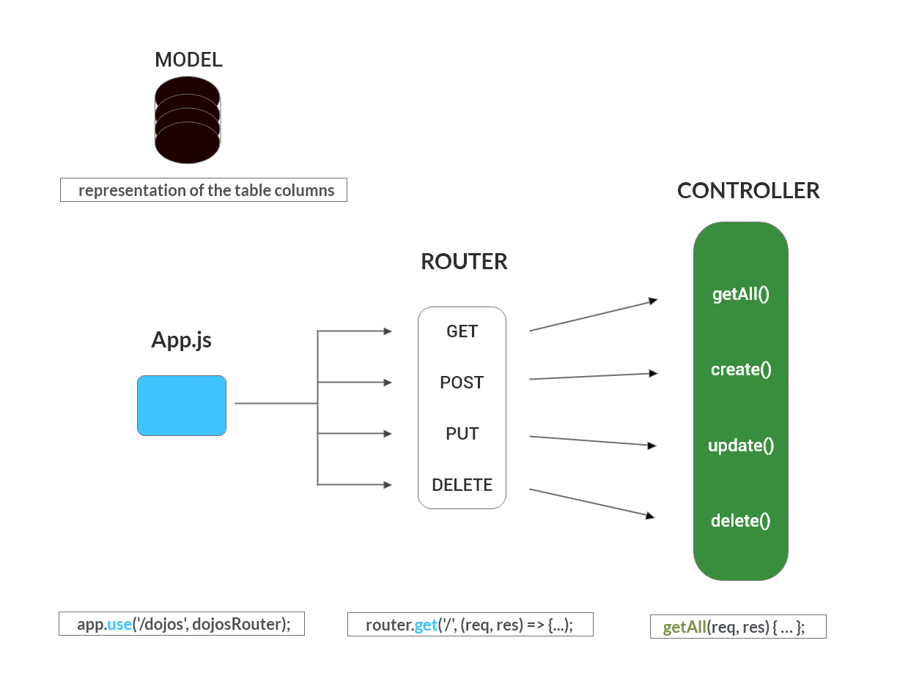

# Routing in Express: A Comprehensive Guide

Routing in Express.js is a fundamental concept that allows you to define how your application responds to different HTTP requests. In this comprehensive guide, we'll explore routing in Express.js, including route definition, route parameters, middleware, and best practices.


## What is Routing in Express.js?

Routing is the process of determining how an application responds to client requests at specific endpoints (URLs). In Express.js, routing involves defining routes that map HTTP methods (GET, POST, PUT, DELETE, etc.) to specific functions known as route handlers. Each route handler is responsible for handling a particular type of request and sending an appropriate response.

## Basic Route Definition

To define a route in Express.js, you typically use the `app` object, which represents your Express application. Here's how to define a basic route:

```javascript
const express = require('express');
const app = express();

app.get('/', (req, res) => {
  res.send('Hello, Express!');
});

app.listen(3000, () => {
  console.log('Server is running on port 3000');
});
```

In the example above:

- We use the `app.get()` method to define a route that responds to HTTP GET requests at the root URL `/`.
- The route handler function `(req, res)` is executed when a GET request is made to the root URL.
- Inside the route handler, we use `res.send()` to send a simple "Hello, Express!" response to the client.

## Route Parameters

Route parameters allow you to capture values from the URL and use them in your route handler. Route parameters are denoted by a colon `:` followed by the parameter name. For example:

```javascript
app.get('/users/:id', (req, res) => {
  const userId = req.params.id;
  res.send(`User ID: ${userId}`);
});
```

In this example, the `:id` route parameter captures a value from the URL, and we access it using `req.params.id`. For instance, a request to `/users/123` would yield "User ID: 123" as the response.

## Route Middleware

Middleware functions are used to perform actions before or after route handlers. They can be applied globally or to specific routes. Middleware functions are useful for tasks like authentication, logging, data validation, and more. To use middleware for a route, pass it as an argument before the route handler:

```javascript
// Global middleware
app.use((req, res, next) => {
  console.log('Middleware executed globally');
  next();
});

// Route-specific middleware
app.get('/secure', (req, res, next) => {
  console.log('Middleware executed for /secure route');
  next();
}, (req, res) => {
  res.send('This is a secure route');
});
```

In the above code:

- The first middleware is executed globally for all routes, logging "Middleware executed globally" for every request.
- The second middleware is specific to the `/secure` route, logging "Middleware executed for /secure route" only for requests to that route.

## Route Best Practices

Here are some best practices for routing in Express.js:

1. **Organize Routes**: Group related routes together in separate route files to keep your code organized and maintainable.

2. **Use Route Parameters**: Use route parameters to capture dynamic values from the URL.

3. **Middleware**: Apply middleware as needed for authentication, validation, logging, and other tasks.

4. **Error Handling**: Implement error handling middleware to handle errors gracefully and prevent application crashes.

5. **RESTful Routing**: When building RESTful APIs, follow REST conventions for route naming and HTTP methods (GET, POST, PUT, DELETE).

6. **Versioning**: Consider versioning your APIs in the URL (e.g., `/api/v1/users`) to maintain backward compatibility when making changes.

7. **Documentation**: Document your routes and their functionality for future reference.

Routing is a foundational concept in Express.js, and mastering it is essential for building robust web applications and APIs. By following best practices and understanding route parameters and middleware, you can create well-structured and efficient Express.js applications.