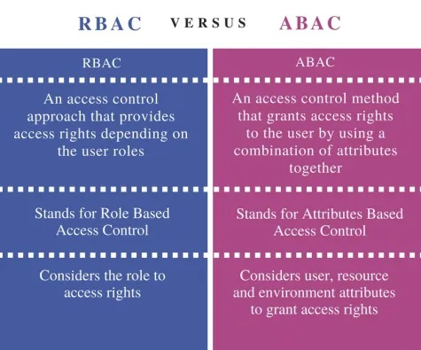

# Authorization Tutorial

Authorization is a critical concept in cybersecurity and web development that comes into play after authentication. It determines what actions or resources an authenticated user or system is allowed to access. In this tutorial, we'll delve into what authorization is, provide examples, and explore various types of authorization methods.

## What is Authorization?

**Authorization** is like a permission slip or a set of rules that defines what you're allowed to do after you've proven your identity through authentication. Once you've authenticated (proven who you are), authorization steps in to say, "Okay, now that we know you're you, here's what you're allowed to see or do."

## Authorization Example

Let's illustrate authorization with a practical example:

**Scenario**: You've successfully logged into your email account.

1. **Authentication**: You've proven that you're the legitimate owner of the email account by entering your username and password.
2. **Authorization Check**: Now, the email service checks what you can and can't do.
3. **Access Granted**: You can read and send emails, but you can't access someone else's inbox or change account settings.
4. **Access Denied**: If you try to access another user's inbox or modify settings you're not authorized to change, you'll be denied.

In this example, authorization determines the actions you're permitted to take within your email account after you've authenticated.

## Types of Authorization Methods

### 1. **Role-Based Authorization**
   - **Description**: Users are assigned roles (e.g., admin, user, guest), and each role has predefined permissions.
   - **Example**: An admin can delete user accounts, while a regular user can only edit their own profile.

### 2. **Attribute-Based Authorization**
   - **Description**: Access is granted or denied based on attributes or characteristics of the user, resource, or request.
   - **Example**: A document management system might allow access based on the document's classification (public, private, confidential) and the user's security clearance.

### 3. **Rule-Based Authorization**
   - **Description**: Access is determined by a set of rules or policies defined by the system administrator.
   - **Example**: A corporate network might have a rule that restricts internet access during working hours but allows it during breaks.

### 4. **Discretionary Access Control (DAC)**
   - **Description**: Owners of resources decide who can access them and what permissions they have.
   - **Example**: You decide who can view or edit your private Google Drive documents by setting access permissions.

### 5. **Mandatory Access Control (MAC)**
   - **Description**: Access is determined by system administrators and security policies. Users have no control.
   - **Example**: Government agencies use MAC to classify and restrict access to classified information based on security clearances.

### 6. **Role-Based Access Control (RBAC)**
   - **Description**: Users are assigned roles, and roles are assigned permissions. Simplifies access management.
   - **Example**: In an online store, customer support representatives have permission to process returns, while warehouse staff can only manage inventory.

### 7. **Policy-Based Access Control (PBAC)**
   - **Description**: Access is controlled by policies, which are more flexible than traditional access control methods.
   - **Example**: A content management system that uses policies to determine who can edit specific types of content based on metadata.

Understanding these authorization methods is crucial because they help determine who can do what within a system or application, ensuring data security and compliance with privacy regulations.

In summary, authorization is like setting rules after proving your identity. It defines what you're allowed to access or do within a system. Different authorization methods, such as role-based, attribute-based, and rule-based, help ensure that the right people have access to the right resources.