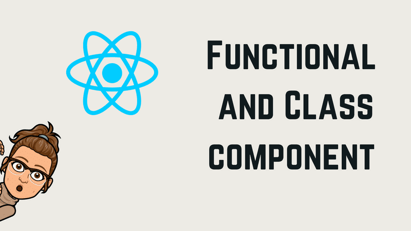

# Tutorial: Class and Function Components in React

Welcome to the tutorial on Class and Function Components in React. In this tutorial, we will explore the different ways of creating components, delve into class and function components, understand their differences, and discuss the recommended approach for creating components.

## Creating Components in React

There are mainly two ways to create components in React:

1. **Function Components:** These are JavaScript functions that return JSX to define the UI.

2. **Class Components:** These are ES6 classes that extend the `React.Component` class and define the UI using the `render()` method.

## Class Component Example

```jsx
import React, { Component } from 'react';

class ClassComponent extends Component {
  render() {
    return <h1>Hello from Class Component</h1>;
  }
}

export default ClassComponent;
```

## Function Component Example

```jsx
import React from 'react';

function FunctionComponent() {
  return <h1>Hello from Function Component</h1>;
}

export default FunctionComponent;
```


## Differences between Class and Function Components

| Aspect                   | Class Component                             | Function Component                   |
|--------------------------|---------------------------------------------|-------------------------------------|
| Syntax                   | Uses class syntax and extends `React.Component`. | Uses a simple function declaration. |
| State Management        | Can manage state using `this.state` and lifecycle methods. | Cannot manage state on its own, but can use React Hooks for state. |
| Lifecycle Methods       | Supports all lifecycle methods (e.g., `componentDidMount`). | Supports only the `useEffect` hook for lifecycle functionality. |
| Performance              | Can have some performance overhead due to the lifecycle methods. | Generally has better performance due to no lifecycle overhead. |
| Context                  | Can use `this.context` for accessing context. | Can use `useContext` hook for accessing context. |
| Recommended Approach    | Historically used before functional components gained more capabilities. | Recommended for most scenarios due to simplicity and hooks. |

## Recommended Approach

**Function Components:** Unless you need to use lifecycle methods or manage state in a more complex manner, using function components is the recommended approach. They offer cleaner syntax, better performance, and the ability to use React Hooks for state management and other functionalities.

## Summary:

- Components can be created using class syntax or function syntax.
- Class components use lifecycle methods and can manage state.
- Function components are simpler, have better performance, and can use React Hooks.
- Function components are recommended for most use cases due to their simplicity and modern capabilities.
