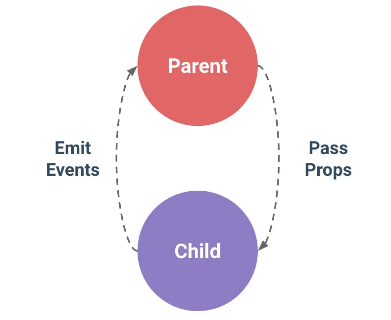

## Passing Data from Child to Parent in React using Callbacks

In React, passing data from a child component to a parent component can be achieved by using a technique called **callbacks**. Callbacks provide a way for child components to communicate with their parent components, allowing for a seamless exchange of data. This tutorial will guide you through the process of passing data from child to parent using callbacks in React.

### Understanding Callbacks for Data Flow

Callbacks are functions that are passed as props from a parent component to a child component. The child component can then invoke the callback function to send data back to the parent component. This mechanism establishes a clear channel of communication between the two components.


### Implementing Data Passing with Callbacks

Let's walk through the steps to pass data from a child component to a parent component using callbacks:

1. **Define the Callback in the Parent Component:** In the parent component, create a function that will serve as the callback. This function will receive data from the child component.

   ```jsx
   // ParentComponent.js
   
   import React, { useState } from 'react';
   import ChildComponent from './ChildComponent';
   
   function ParentComponent() {
     const [receivedData, setReceivedData] = useState('');
     
     const handleChildData = (data) => {
       setReceivedData(data);
     };
     
     return (
       <div>
         <ChildComponent onDataReceived={handleChildData} />
         <p>Data from child: {receivedData}</p>
       </div>
     );
   }
   
   export default ParentComponent;
   ```

2. **Invoke the Callback in the Child Component:** In the child component, use the callback function passed as a prop to send data back to the parent component.

   ```jsx
   // ChildComponent.js
   
   import React, { useState } from 'react';
   
   function ChildComponent(props) {
     const [childData, setChildData] = useState('');
     
     const sendDataToParent = () => {
       const dataToSend = 'Data from child component';
       props.onDataReceived(dataToSend);
       setChildData(dataToSend);
     };
     
     return (
       <div>
         <button onClick={sendDataToParent}>Send Data to Parent</button>
         <p>Child data: {childData}</p>
       </div>
     );
   }
   
   export default ChildComponent;
   ```

### Passing Parameters through Callbacks

You can also pass parameters along with the callback to provide additional context to the parent component.

```jsx
// ParentComponent.js

// ...

function ParentComponent() {
  // ...

  const handleChildData = (data, source) => {
    setReceivedData(`Received from ${source}: ${data}`);
  };

  return (
    // ...
  );
}
```

```jsx
// ChildComponent.js

// ...

function ChildComponent(props) {
  // ...

  const sendDataToParent = () => {
    const dataToSend = 'Data from child component';
    const source = 'Child';
    props.onDataReceived(dataToSend, source);
    setChildData(dataToSend);
  };

  return (
    // ...
  );
}
```

### Summary

Using callbacks to pass data from child to parent is a valuable technique in React, enabling components to collaborate effectively and share information. With this guide, you've learned how to implement this data flow pattern in your applications. Incorporate this knowledge into your React projects to build more interactive and dynamic user interfaces.