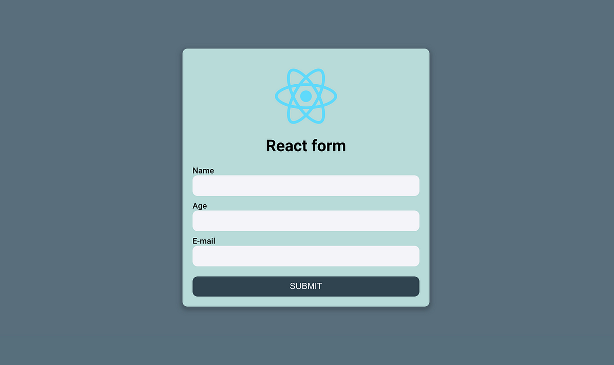

## Handling Forms in React: A Step-by-Step Guide

Handling forms is a crucial aspect of building interactive web applications. In React, managing form data involves capturing user input, validating it, and updating the component state accordingly. This tutorial will guide you through the process of handling forms in React, from basic input fields to more advanced form controls.

### Introduction to Form Handling in React

Forms in React operate similarly to traditional HTML forms but with some key differences. React components manage their own state, making it essential to update the state whenever form inputs change. By doing so, you can reflect the user's input in the UI and manage form submission effectively.

### Basic Form Handling

Here's a step-by-step guide to handling a simple form in React:

1. **Initialize Component State:** Define an initial state that matches the form's data fields.

2. **Create Input Elements:** Create input elements within the `render()` method. Use the `value` prop to bind the input to the state.

3. **Implement Event Handlers:** Write event handlers for the `onChange` event of each input. These handlers update the state based on user input.

4. **Handle Form Submission:** Implement a form submission handler using the `onSubmit` event. Use the `preventDefault()` method to prevent the default form submission behavior.

### Example: Basic Form Handling

```jsx
import React, { Component } from 'react';

class BasicFormHandling extends Component {
  constructor(props) {
    super(props);
    this.state = {
      username: '',
      email: '',
    };
  }

  handleInputChange = (event) => {
    const { name, value } = event.target;
    this.setState({ [name]: value });
  };

  handleSubmit = (event) => {
    event.preventDefault();
    console.log('Form submitted:', this.state);
  };

  render() {
    return (
      <div>
        <form onSubmit={this.handleSubmit}>
          <label>
            Username:
            <input
              type="text"
              name="username"
              value={this.state.username}
              onChange={this.handleInputChange}
            />
          </label>
          <br />
          <label>
            Email:
            <input
              type="email"
              name="email"
              value={this.state.email}
              onChange={this.handleInputChange}
            />
          </label>
          <br />
          <button type="submit">Submit</button>
        </form>
      </div>
    );
  }
}

export default BasicFormHandling;
```

### Controlled Components

In React, inputs are known as "controlled components" because their value is controlled by the component's state. This enables you to manage and manipulate the input's value easily.

### Form Validation

Form validation is a crucial part of handling forms. You can implement validation logic in the event handlers to ensure that user input meets specific requirements.

### Advanced Form Controls

React provides specialized form controls like `textarea`, `select`, and `checkbox` inputs. Handling these controls follows similar principles but might involve using different event types and props.

### Conclusion

Handling forms in React involves managing user input, updating component state, and handling form submission. By following the principles outlined in this guide, you'll be well-equipped to create interactive and user-friendly forms in your React applications. Remember to consider form validation and utilize advanced form controls as needed to enhance the user experience.