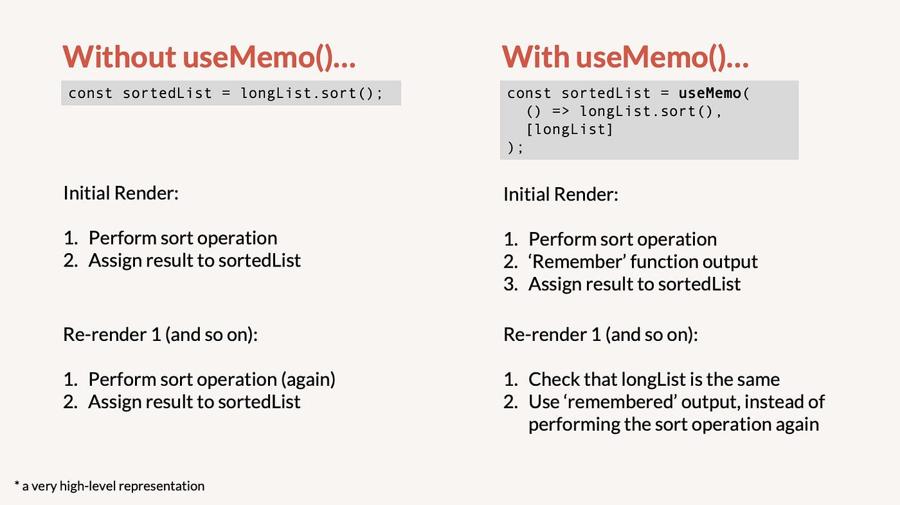

## Harnessing the Power of useMemo in React: Optimizing Performance with Memoization

The `useMemo` hook is a performance optimization tool in React's hooks toolkit that enables components to memoize expensive computations. This tutorial dives deep into the `useMemo` hook, unveiling its purpose, usage, and impact on enhancing your React application's performance.

### What is the useMemo Hook?

In React, re-rendering components can sometimes lead to unnecessary re-computations of expensive functions or calculations. The `useMemo` hook offers a solution by memoizing the result of such computations, ensuring they are recalculated only when necessary.



### Using the useMemo Hook

Let's explore how to use the `useMemo` hook to optimize component performance by memoizing the result of a computation.

```jsx
import React, { useMemo, useState } from 'react';

function Fibonacci({ n }) {
  // Memoize the calculation of the nth Fibonacci number
  const fib = useMemo(() => {
    if (n <= 1) return n;
    return Fibonacci({ n: n - 1 }) + Fibonacci({ n: n - 2 });
  }, [n]); // Dependency array ensures recalculation when "n" changes

  return <div>Fibonacci({n}): {fib}</div>;
}

function App() {
  const [number, setNumber] = useState(10);

  return (
    <div>
      <Fibonacci n={number} />
      <button onClick={() => setNumber(number + 1)}>Increase Number</button>
    </div>
  );
}

export default App;
```

In this example, the `Fibonacci` component uses the `useMemo` hook to memoize the calculation of the nth Fibonacci number. The calculation is only recalculated when the `n` prop changes, thanks to the dependency array `[n]`.

### Performance Optimization

The `useMemo` hook can significantly optimize performance when dealing with computationally expensive operations.

```jsx
import React, { useMemo } from 'react';

function ExpensiveComponent({ data }) {
  // Perform expensive computation only when "data" changes
  const result = useMemo(() => {
    // Perform complex calculations based on "data"
    // ...
    return computedResult;
  }, [data]);

  return <div>{result}</div>;
}
```

In this example, the `result` is memoized using `useMemo`, preventing unnecessary recalculations when the `data` prop remains the same.

### Benefits of useMemo

- **Performance Enhancement:** Memoization prevents redundant computations, optimizing component rendering and application performance.

- **Selective Recalculation:** `useMemo` allows you to specify dependencies, ensuring calculations are updated only when necessary.

- **Improved Responsiveness:** Memoization can lead to smoother user experiences by minimizing computation-related delays.

### Conclusion

The `useMemo` hook offers a valuable mechanism for optimizing performance in React applications. By memoizing expensive computations and calculations, you can reduce unnecessary re-rendering and improve the efficiency of your components. This tutorial provided a comprehensive exploration of the `useMemo` hook, its purpose, and how it contributes to optimizing your React application. Apply this knowledge to strategically use `useMemo` in your components and create more responsive and performant user interfaces.