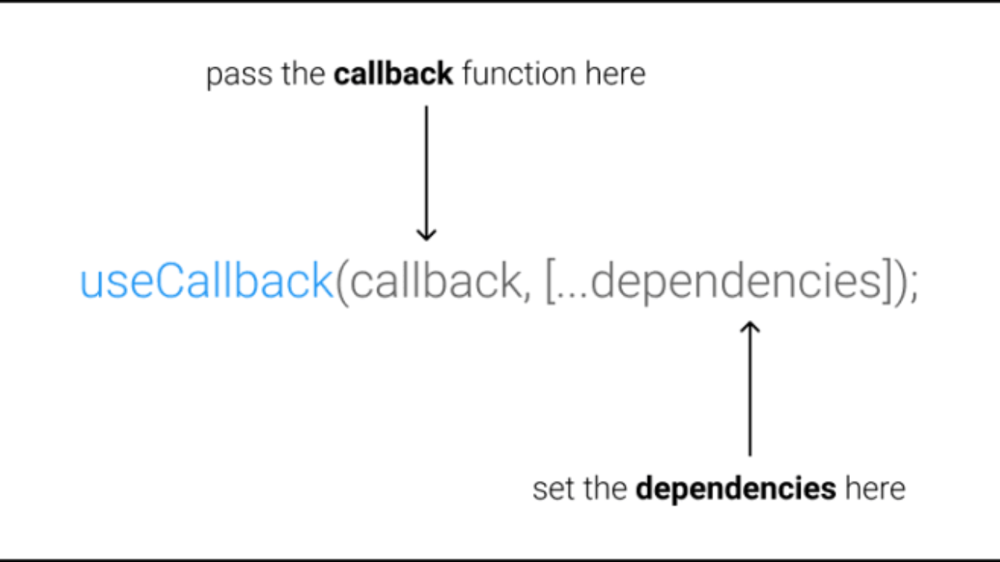

## Unveiling the Potential of useCallback in React: Enhancing Performance with Function Memoization

The `useCallback` hook is a valuable asset in React's hooks arsenal that optimizes performance by memoizing functions. This tutorial delves into the world of the `useCallback` hook, unraveling its purpose, applications, and its role in boosting your React application's efficiency.

### What is the useCallback Hook?

In React, passing functions as props can sometimes lead to unnecessary re-renders, especially when the functions are recreated with every render. The `useCallback` hook offers a solution by memoizing the functions, ensuring they remain consistent across renders.




### Using the useCallback Hook

Let's explore how to use the `useCallback` hook to memoize functions and enhance your component's performance.

```jsx
import React, { useState, useCallback } from 'react';

function Counter({ increment }) {
  return <button onClick={increment}>Increment</button>;
}

function App() {
  const [count, setCount] = useState(0);

  // Memoize the increment function to prevent re-creation on each render
  const increment = useCallback(() => {
    setCount(count + 1);
  }, [count]);

  return (
    <div>
      <p>Count: {count}</p>
      <Counter increment={increment} />
    </div>
  );
}

export default App;
```

In this example, the `increment` function is memoized using the `useCallback` hook. This ensures that the function remains consistent across renders, preventing unnecessary re-creation.

### Optimizing Prop Passing

`useCallback` is particularly useful when passing functions as props to child components.

```jsx
import React, { useState, useCallback } from 'react';

function ChildComponent({ onClick }) {
  return <button onClick={onClick}>Click Me</button>;
}

function ParentComponent() {
  const [count, setCount] = useState(0);

  // Memoize the click handler to prevent re-creation
  const handleClick = useCallback(() => {
    setCount(count + 1);
  }, [count]);

  return (
    <div>
      <p>Count: {count}</p>
      <ChildComponent onClick={handleClick} />
    </div>
  );
}

export default ParentComponent;
```

In this example, the `handleClick` function is memoized using `useCallback` before being passed as a prop to `ChildComponent`. This ensures that the function remains the same even if the parent component re-renders.

### Benefits of useCallback

- **Enhanced Performance:** Memoizing functions using `useCallback` prevents unnecessary function re-creation and re-renders.

- **Stable Dependencies:** The hook allows you to specify dependencies to ensure accurate function memoization.

- **Efficient Prop Passing:** `useCallback` is particularly beneficial when passing functions as props to child components.

### Conclusion

The `useCallback` hook is a vital tool for optimizing performance in React applications. By memoizing functions and preventing unnecessary re-creation, you can improve your application's efficiency and responsiveness. This tutorial offered a comprehensive exploration of the `useCallback` hook, its purpose, and its role in enhancing React application performance. Use this knowledge to strategically apply `useCallback` and create more efficient, performant, and maintainable components.