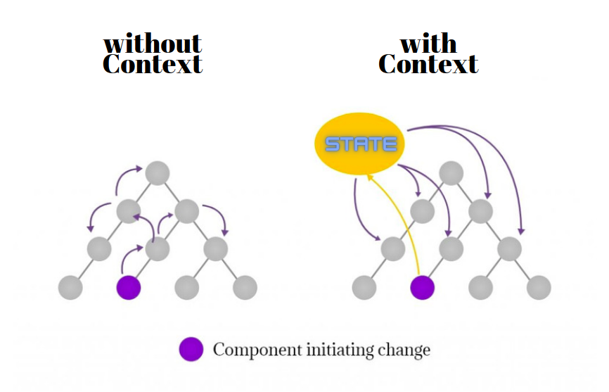

## Harnessing the Power of useContext in React: Simplifying Component Communication

The `useContext` hook is a pivotal addition to React's hooks ecosystem, enabling components to access context without nesting multiple levels of props passing. This tutorial provides a comprehensive guide to the `useContext` hook, outlining its purpose, implementation, and practical applications.

### What is the useContext Hook?

In React, context provides a way to share data between components without having to explicitly pass it through props at every level. The `useContext` hook simplifies the process of consuming context values within functional components.




### Using the useContext Hook

Let's dive into how to use the `useContext` hook to consume context values within a functional component.

```jsx
import React, { useContext } from 'react';

// Create a context
const ThemeContext = React.createContext();

// A component consuming the context
function ThemedButton() {
  // Consume the context value using useContext
  const theme = useContext(ThemeContext);

  return <button style={{ background: theme.background, color: theme.foreground }}>Themed Button</button>;
}

// A component providing the context
function App() {
  const theme = {
    foreground: 'white',
    background: 'blue'
  };

  return (
    <ThemeContext.Provider value={theme}>
      <ThemedButton />
    </ThemeContext.Provider>
  );
}

export default App;
```

In this example, the `ThemeContext` is created using `React.createContext()`. The `ThemedButton` component consumes the context using the `useContext` hook. The `App` component provides the context value through the `ThemeContext.Provider`.

### Dynamic Context Value

The context value can be dynamic, allowing components to access and update shared data.

```jsx
import React, { createContext, useContext, useState } from 'react';

const CountContext = createContext();

function Counter() {
  const count = useContext(CountContext);
  return <div>Count: {count}</div>;
}

function App() {
  const [count, setCount] = useState(0);

  return (
    <CountContext.Provider value={count}>
      <Counter />
      <button onClick={() => setCount(count + 1)}>Increment Count</button>
    </CountContext.Provider>
  );
}

export default App;
```

In this example, the `Counter` component consumes the dynamic context value provided by the `App` component. When the button in the `App` component is clicked, the context value is updated, and the `Counter` component reflects the change.

### Benefits of useContext

- **Efficient Data Sharing:** `useContext` streamlines data sharing across components, bypassing the need for prop drilling.

- **Simpler Component Structure:** By avoiding deep nested prop passing, components become more modular and easier to manage.

- **Dynamic Updates:** Context values can be updated dynamically, allowing for real-time changes in consuming components.

### Conclusion

The `useContext` hook offers a streamlined solution for sharing data between components in a React application. By simplifying context consumption and eliminating the need for excessive prop passing, you can build more organized and maintainable code. This tutorial provided an extensive exploration of the `useContext` hook, from creating and consuming context to dynamically updating shared data. Apply this knowledge to optimize your React components' communication and enhance the efficiency of your application's data flow.