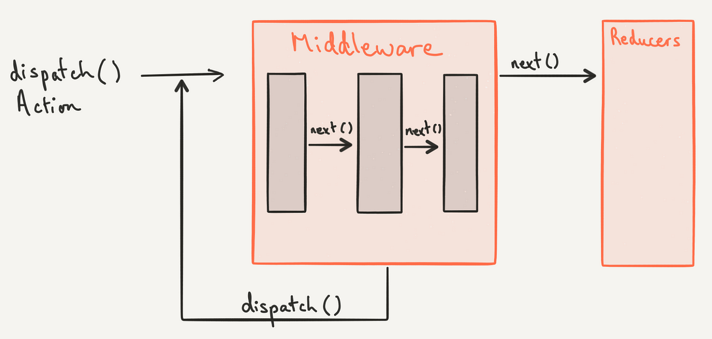

# Understanding Middleware in Redux Toolkit

Welcome to this beginner-friendly tutorial on Middleware in Redux Toolkit! In this guide, we'll explain what middleware is and how it can help enhance your Redux applications. We'll use simple examples and easy-to-understand explanations that anyone, including a 15-year-old, can follow.


## What is Middleware?

Imagine you're playing a video game, and you want to customize your character's appearance before starting the game. Middleware in Redux is like a special room you pass through where you can add cool accessories to your character before it enters the game world. In simple terms, middleware is a way to add extra features to Redux.

## Why Do We Need Middleware?

Middleware is like a helpful assistant that stands between the actions you send to Redux and the store. It can do things like checking the actions, logging information, or even making changes to the actions before they reach the store. This can be super useful for tasks like authentication, logging, or handling asynchronous operations.



## Example: Logging Middleware

Let's use an example of a video game again! Imagine you're playing a game, and you want to keep track of all the cool things your character is doing. Middleware can help you do this by logging actions as they happen.

Here's how you might create a simple logging middleware:

```javascript
const loggingMiddleware = store => next => action => {
  console.log('Action:', action.type);
  const result = next(action);
  return result;
};
```

In this code, `store` is the Redux store, `next` is a function that lets the action continue to the next middleware or the store, and `action` is the action you're sending to Redux. The `console.log` line logs the action's type, and `next(action)` makes sure the action continues to where it's supposed to go.

## Using Middleware in Redux Toolkit

Using middleware with Redux Toolkit is like adding an extra tool to your game! Here's how you can add middleware to your Redux store:

```javascript
import { configureStore, getDefaultMiddleware } from '@reduxjs/toolkit';
import loggingMiddleware from './loggingMiddleware'; // Replace with the path to your middleware

const store = configureStore({
  reducer: rootReducer,
  middleware: [...getDefaultMiddleware(), loggingMiddleware],
});
```

In this example, `getDefaultMiddleware()` gives you some useful default middleware that Redux Toolkit provides. You can add your custom middleware, like `loggingMiddleware`, to the array.

## Summary

Middleware is like a helpful sidekick for your Redux store, making it more powerful and flexible. Just like adding cool accessories to your video game character, middleware lets you add extra features to your Redux applications. You've learned that middleware can do things like logging actions, handling asynchronous tasks, and more. By following this guide, you're now equipped to use middleware to make your Redux applications even cooler! Happy coding!